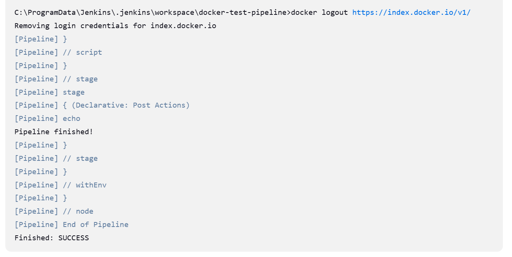
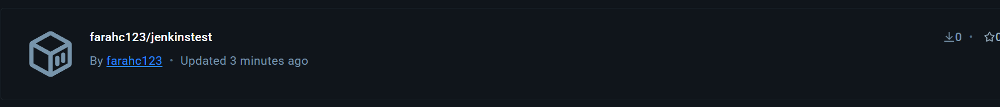

# Project 1

- [Project 1](#project-1)
    - [Goal of the project](#goal-of-the-project)
    - [Initial steps](#initial-steps)
  - [Practice job 1](#practice-job-1)
    - [Old notes](#old-notes)

### Goal of the project

The goal of this project is to implement a CI/CD pipeline utilising AWS or Azure services for efficient software delivery. The system should use Jenkins, Docker, and Kubernetes for automated deployment and management of containerised applications.

### Initial steps

1. I created a t3.micro EC2 Jenkins server with the usual network settings (open on ports 80, 8080, 22, and 3000)
2. I installed Jenkins as usual by following [these steps](https://phoenixnap.com/kb/install-jenkins-ubuntu)
3. Logged into the EC2 and installed Docker
4. I logged into the Jenkins server on *<EC2 public IP>:8080* and installed the NodeJS, SSH Agent, Docker, and Kubernetes plugins
5. I added SSH credentials to Jenkins for my GitHub and Minikube EC2 instance
6. I added my Docker login credentials to Jenkins 

- I approached this project breaking each stage up into an isolated job that I could get working on its own on my local machine before merging them and running them on a Jenkins EC2 instance 

http://54.246.228.210:8080/

## Practice job 1

- On my local machine, I created a pipeline script job that would build my Sparta app from a Dockerfile located in the nodejs-sparta-app folder (which contained the build context folder of /app) and push it to my dockerhub using my credentials
- [Pipeline script here](<Files/pipeline file>)
- This worked 
- Proof from Docker Hub 

### Old notes
1. I created a freestyle job to test my GitHub code (and set up a webhook on my GitHub repo)
2. I created a freestyle job to merge my GitHub code
   - These two jobs worked 
3. I created a pipeline to do the rest of the jobs