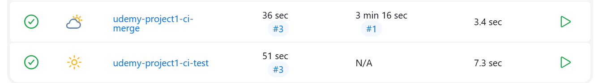

# Project 1

- [Project 1](#project-1)
    - [Goal of the project](#goal-of-the-project)
    - [Initial steps](#initial-steps)
  - [Creating the pipeline](#creating-the-pipeline)

### Goal of the project

The goal of this project is to implement a CI/CD pipeline utilising AWS or Azure services for efficient software delivery. The system should use Jenkins, Docker, and Kubernetes for automated deployment and management of containerised applications.

### Initial steps

1. I created a t3.micro EC2 Jenkins server with the usual network settings (open on ports 80, 8080, 22, and 3000)
2. I installed Jenkins as usual by following [these steps](https://phoenixnap.com/kb/install-jenkins-ubuntu)
3. I logged into the Jenkins server on *<EC2 public IP>:8080* and installed the NodeJS, SSH Agent, Docker, and Kubernetes plugins
4. I added SSH credentials to Jenkins for my GitHub and Minikube EC2 instance
5. I added my Docker login credentials to Jenkins 

## Creating the pipeline

1. I created a freestyle job to test my GitHub code (and set up a webhook on my GitHub repo)
2. I created a freestyle job to merge my GitHub code (and set up a webhook on my GitHub repo)
   - These two jobs worked 
3. I created a pipeline to do the rest of the jobs