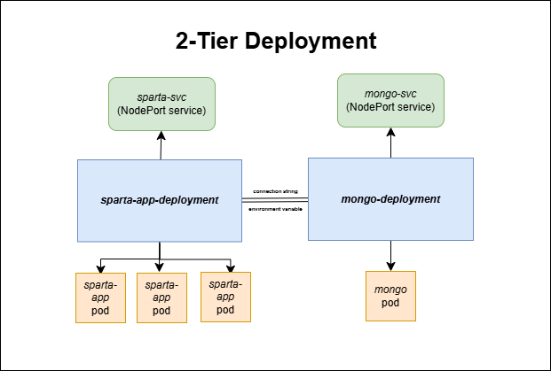
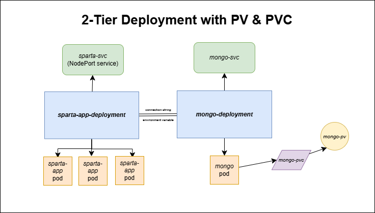

# **Project 10: Kubernetes**

- [**Project 10: Kubernetes**](#project-10-kubernetes)
  - [Goal of this project](#goal-of-this-project)
  - [GitHub repo link](#github-repo-link)
  - [Prerequisites](#prerequisites)
- [**Research**](#research)
  - [Kubernetes](#kubernetes)
  - [Managed K8s services](#managed-k8s-services)
  - [Container security](#container-security)
    - [Kubernetes objects](#kubernetes-objects)
    - [Lifecycle](#lifecycle)
    - [Autoscaling](#autoscaling)
- [**Day 1 Tasks**](#day-1-tasks)
  - [Get Kubernetes running using Docker Desktop](#get-kubernetes-running-using-docker-desktop)
  - [Create Nginx deployment only](#create-nginx-deployment-only)
  - [Get a NodePort service running](#get-a-nodeport-service-running)
  - [See what happens when we delete a pod](#see-what-happens-when-we-delete-a-pod)
  - [Increase replicas with no downtime](#increase-replicas-with-no-downtime)
    - [Method 1: editing the deployment file in real-time](#method-1-editing-the-deployment-file-in-real-time)
    - [Method 2: Apply a modified deployment file](#method-2-apply-a-modified-deployment-file)
    - [Method 3: Use the scale command](#method-3-use-the-scale-command)
  - [Delete K8s deployments and services](#delete-k8s-deployments-and-services)
  - [K8s deployment of NodeJS Sparta test app](#k8s-deployment-of-nodejs-sparta-test-app)
  - [**Blockers**](#blockers)
- [**Day 2 Tasks**](#day-2-tasks)
  - [Create 2-tier deployment with a PersistentVolume (PV) for the database](#create-2-tier-deployment-with-a-persistentvolume-pv-for-the-database)
  - [Use Horizontal Pod Autoscaler (HPA) to scale the app](#use-horizontal-pod-autoscaler-hpa-to-scale-the-app)
  - [**Blockers**](#blockers-1)
- [**Day 3 Tasks**](#day-3-tasks)
  - [Setup Minikube on a cloud instance running Ubuntu 22.04 LTS](#setup-minikube-on-a-cloud-instance-running-ubuntu-2204-lts)
  - [Deploy three apps on one cloud instance running Minikube](#deploy-three-apps-on-one-cloud-instance-running-minikube)
    - [First app](#first-app)
    - [Second app](#second-app)
    - [Third app](#third-app)
  - [Use Kubernetes to deploy the Sparta test app in the cloud](#use-kubernetes-to-deploy-the-sparta-test-app-in-the-cloud)
  - [Make Minikube start automatically on boot](#make-minikube-start-automatically-on-boot)
  - [**Blockers**](#blockers-2)
- [**What I learnt**](#what-i-learnt)
- [**Benefits I personally saw from the project**](#benefits-i-personally-saw-from-the-project)
  - [Helpful links](#helpful-links)

## Goal of this project

The goal of this project is to containerise the deployment of the Sparta test app (which uses NodeJS v20) and database using a Kubernetes (Minikube) cluster.

## GitHub repo link

[The GitHub repository for this project is accessible here](https://github.com/farahc123/tech501-bench-udemy-pathways/tree/main/Project%2010)

## Prerequisites

1. Docker Desktop
2. Docker Hub container image for Sparta test app

# **Research**

## Kubernetes

- **Kubernetes (or K8s)**: an open-source container orchestration system that automates the deployment, scaling, & management of apps running in containers
- Helpful because it can self-heal pods, automatically scale resources to meet changing needs based on traffic, & apply updates to apps with zero down-time using Rollout Strategies
- It can automate:
  - starting new apps when needed
  - restarting apps if they crash
  - spreading out work so that no one part of the system is overloaded
  - scaling up or down based on demand
- Companies that use K8s:
  - Spotify
  - Booking.com
  - Netflix
- **Cluster**: a Kubernetes environment, which includes one or more nodes; has two elements:
  - **Control Plane or master/control node**: the centralised brain of a cluster; governs and coordinates the cluster's operations, schedules new containers onto nodes, monitors the cluster's health, and provides an API that we interact with
  - **Data plane**: made up of worker nodes and their pods; carries out the policies set on the Control Plane
**- Parts of the Control Plane (non-exhaustive):**
  - **kube-apiserver:** essentially the cluster's front door; the part of the Control Plane that allows us to interact with a running K8s cluster; all administrative commands & resource requests pass thru this
  - **etcd**: stores all config data and the current state of the cluster
  - **kube-controller-manager:** starts and runs K8s's built-in controllers; continually adjusts the cluster's state to ensure it matches the desired state; creates, scales, & deletes objects in response to API requests or load changes
  - **kube-scheduler:** assigns new pods (i.e. containers) onto the nodes in a cluster based on resource requirements, constraints, & policies
**- Parts of the data plane (i.e. worker nodes):**
  - **kubelet:** the administrative agent that runs on each node; it communicates with the Control Plane to receive instructions; ensures pods are running and reports their statuses to Control Plane; responsible for pulling container images and starting them in response to scheduling requests
  - **kube-proxy:** configures host's networking system on each node in a cluster so that traffic can reach the cluster's services 
  - **container runtime**: software that runs & manages containers (e.g. Docker or Containerd); creates and manages containerised apps within Pods
- **kubectl**: the CLI tool used to interact with clusters
- **Manifest file**: a YAML file that describes the desired state of the K8s objects you want to create/manage (i.e. it's declarative); can be reused across environments; you can group multiple related resources in one file and delineate them with `---`; these resources are then created with a `kubectl apply -f <file path>` command
- **Minikube**: a development/learning tool that allows you to run a single-node K8s cluster on your local machine
- **Ingress**: if you  have multiple services that need to be accessed via the same external IP, routes traffic to a service based on hostnames or paths; [see example here](example-ingress.yml)

## Managed K8s services

- a paid service in which a third party (e.g. AWS's EKS, Azure's AKS, GCP's GKE) handles the lifecycle of Kubernetes clusters to simplify containerised environments for the client
- **Benefits of using a managed K8s service**:
  - reduced need for in-house expertise, which is usually required when you're running a K8s environment at scale
  - frees up teams from configuring/managing K8s so they can focus less on the infrastructure and more on the product
  - usually offer enhanced security protocols
- **Downsides of using a managed K8s service:**
  - they come with an added cost
  - you may have less control over some aspects of the cluster environment

## Container security

- you should store containers on secure registries/repositories with access control, otherwise they can be modified, deleted, or be subject to data breaches
- you should also sign images e.g. through Docker Content Trust or Notary to verify them
- use vulnerability scanners on images
- to reduce attack surfaces, you should include only the components the application needs in the container
- use trustworthy (e.g. official/maintained) images
- isolate container networks
- **Pros of using maintained images as base container images**:
  - reliable
  - have clear documentation
  - best practices are usually implemented already
  - easy to pull
- **Cons**:
  - less flexibility in terms of customisation
  - you have no control over their size (e.g. if you only need some features), which can increase performance overhead
  - you may become too dependent on the developer which could introduce issues in the long run
  - if you're deploying at scale, there may be costs incurred

**Kubernetes architecture diagrams by Labex:**


### Kubernetes objects

- **Pod**: essentially a box that can hold one or more containers which share a network and storage and work together to run an app; usually represents a single instance of a running app; smallest deployable unit in K8s
- **Replicas**: identical Pods running within a cluster at the same time for high availability and scaling as one replica/pod can only handle a certain amount of concurrent requests before the app becomes slow/unresponsive; replicas can be managed by a deployment or a **ReplicaSet**, which creates new replicated pods if one fails/is deleted (but provides fewer features than a deployment)
- **Deployment:** an object that manages a ReplicaSet; has a rolling update mechanism as well as rollback feature
- **Service**: a method for exposing an application on a pod internally or externally; it provides a fixed IP address and DNS name that always point to the set of pods it manages, which is important because pods' actual IP addresses change when created & destroyed so you would otherwise not always be able to connect to them; it defines a policy for how to reliably access the pods by correctly routing external & internal traffic
  - **Types of services:**
    - **ClusterIP** (the default): creates an internal service with an IP address that allows ONLY internal (i.e. in-cluster) network traffic to pods
    - **NodePort**: exposes pods internally as above, but also exposes the same port in each node (which will be within the range 30000-32767; doesn't need to be manually defined) to a `targetPort` (e.g. 8080) for traffic outside of the cluster
    - **LoadBalancer**: does what both of the above do but also creates external network infrastructure to distribute network requests across all of the pods to prevent any from being overwhelmed (via an even **round robin approach**) ; this is the best choice when pods need to be exposed to predictable URLs, though they are more expensive and require a cloud provider to offer load balancing services as they aren't a native K8s object; [see more explanation here](<Day 3 three apps task/Second app/second-service.yml>)
- **Node**: a worker node; a physical or virtual machine that will host and run your pods; these offer the computational and storage resources needed to run pods
- **Namespaces**: logical partitions within a cluster that help organise and manage resources; allow you to apply policies, access controls, & resource quotas on a granular level
  - **Benefits of namespaces:**
    - helpful when you need to **group related workloads** (e.g. by team or environment)
    - **enhance security** and access control by restricting which users can view/modify resources in a namespace
    - **simplify resource management** by effectively applying limits, network policies & other cluster-wide configs
- **Context:** the combination of a cluster, user, and namespace

**Diagram by labex.io**


### Lifecycle

1. When a new app is deployed, the Control Plane places the pods on appropriate nodes
2. The kubelet on each node ensures the pods are healthy and running as instructed
3. Services route traffic to the correct pods, allowing clients to access apps

### Autoscaling

- **Autoscaling:** a K8s feature allowing a cluster to increase/decrease the number of nodes or pod resources in response to demand
- 3 methods of autoscaling with K8s:
  1. **Horizontal Pod Autoscaler (HPA)**: automatically adds/removes pods to handle changing traffic loads and improve performance & availability; by default, it checks resource metrics via the Metrics Server add-on every 15 seconds (the default metric being average CPU usage, though the metric can be customised) — note that it CAN'T add new nodes, as only a Cluster Autoscaler can do this
  2. **Vertical Pod Autoscaler (VPA)**: automatically assigns/unassigns CPU & memory resources (i.e. reservations) for pods
  3. **Cluster Autoscaler**: automatically adds/removes nodes in a cluster based on pods' requested resources

**Diagrams by kubecost.com:**


# **Day 1 Tasks**

## Get Kubernetes running using Docker Desktop

1. I ran `kubectl get service` on Git Bash and got this expected error 
2. To solve this, I enabled Kubernetes in Docker Desktop 
3. I re-ran `kubectl get service` and saw that Kubernetes was now running 

## Create Nginx deployment only

1. Created a [deployment file](k8s-yaml-definitions/local-nginx-deploy/nginx-deploy.yml)
2. Ran `kubectl apply -f nginx-deploy.yml` to create the deployment 
3. Ran `kubectl get deployment nginx-deployment` to get details on the deployment 
4. Ran `kubectl get replicaset` to get details on the ReplicaSets 
5. Ran `kubectl get pods` to get details on the pods 
6. Ran `kubectl get all -l app=nginx` to see details on all three with one command 
7. Tried to access my deployment via my web browser at localhost but this didn't work (as expected), because the ClusterIP is a private IP address only accessible within the cluster 

## Get a NodePort service running

- We do this to expose the app deployment outside of the cluster, making it visible in a browser to the outside world

1. Created a [service file](k8s-yaml-definitions/local-nginx-deploy/nginx-service.yml)
2. Created the service with `kubectl apply -f nginx-service.yml` 
3. Ran `kubectl get svc nginx-svc` to get details on the service 
4. On my web browser, navigated to *localhost:30001* to verify the NodePort service was running  

## See what happens when we delete a pod

1. Ran `kubectl get pods` to list the pods 
2. Ran `kubectl delete pod nginx-deployment-68d98fd8fc-2j8ht` to delete one of the pods (in this case, the first pod) in the above list 
3. Re-ran `kubectl get pods` and saw that Kubernetes had automatically recreated a pod to satisfy the requirements in my deployment file 
4. To get detailed information about the newest pod, I:
   1. Ran `kubectl get pods --sort-by=.metadata.creationTimestamp` to get a list of pods by their time of creation 
   2. Ran `kubectl describe pod nginx-deployment-68d98fd8fc-4pbt2` to get detailed information on the newest pod
   3. Then automated this process by running `kubectl describe pod $(kubectl get pods --sort-by=.metadata.creationTimestamp -o jsonpath='{.items[-1].metadata.name}')` to get details on the newest pod — this command uses the output of the parenthetical command as a variable, with `items[-1]` getting the last item in the list of pods ordered by their creation time (which runs from oldest-newest) 

## Increase replicas with no downtime

- We want to be able to increase the number of replicas (pods) in our deployment in real-time, without needing to destroy and re-create our deployment

### Method 1: editing the deployment file in real-time

1. I ran `kubectl edit deployment nginx-deployment` — this opened up an editable version of the in-use manifest file in Notepad, so I changed the number of replicas to 4, saved, and exited the file  
2. I then ran `kubectl get pods` again and verified that there were now 4 pods running 

### Method 2: Apply a modified deployment file

1. Edited the *nginx-deploy.yml* file in Nano to change the number of replicas to 5
2. Applied the updated file by running `kubectl apply -f nginx-deploy.yml` again
3. Ran `kubectl get pods` again to verify that there were now 5 pods running 

### Method 3: Use the scale command

- This is a quick way of scaling up/down, but isn't persistent (unlike editing the YAML files or using a HPA)

1. I ran `kubectl scale deployment nginx-deployment --replicas=6` to scale this deployment by 1 more replica 
2. Ran `kubectl get pods` again to verify that there were now 6 pods running 

## Delete K8s deployments and services

1. Ran `kubectl delete -f nginx-deploy.yml` and `kubectl delete -f nginx-service.yml` to delete the Nginx deployment and service 
2. Ran `kubectl get all` to verify that they were deleted 

## K8s deployment of NodeJS Sparta test app



1. Created my [*app-deploy.yml*](k8s-yaml-definitions/local-nodejs20-app-deploy/app-deploy.yml) and [*app-service.yml*](k8s-yaml-definitions/local-nodejs20-app-deploy/app-service.yml) manifest files
2. Ran`kubectl apply -f app-deploy.yml` and `kubectl apply -f app-service.yml` to create the resources
3. Navigated to *localhost:30002* (the port specified in my *app-service.yml* file) to verify that this was successful 
4. Created my [*mongodb-service.yml*](k8s-yaml-definitions/local-nodejs20-app-deploy/local-mongodb-deploy/mongo-service.yml) and [*mongodb-deploy.yml*](k8s-yaml-definitions/local-nodejs20-app-deploy/local-mongodb-deploy/mongo-deploy.yml) files 
5. Ran `kubectl apply -f mongodb-deploy.yml` and `kubectl apply -f mongodb-service.yml` to create the resources 
6. Navigated to *localhost:30002/posts* to verify that the deployment and database connection was successful 

## **Blockers**

1. I had issues enabling Kubernetes with Docker Desktop as it hung on "Starting Kubernetes" for a long time; this was solved by manually installing Kubernetes via Chocolatey and then enabling Kubernetes again via Docker Desktop

# **Day 2 Tasks**

## Create 2-tier deployment with a PersistentVolume (PV) for the database

- using a PersistentVolume ensures the data stored on the PV will be retained even if a pod restarts
- a PersistentVolumeClaim (PVC) requests a certain amount of storage from the PV for a resource



1. Created a *mongo-pv.yml* and a *mongo-pvc.yml* file ([both found here](k8s-yaml-definitions/local-nodejs20-app-deploy/local-mongodb-deploy/)), with 100Mb in both the PV and the claim (since I only have one MongoDB pod)
2. Created the PV with `kubectl apply -f mongo-pv.yml`
3. Created the PVC with `kubectl apply -f mongo-pv.yml` 
4. Verified they were both created successfully 
- For reference, this is what my *localhost:30002/posts* page looked like at this point 
1. Deleted my database deployment with `kubectl delete deployment mongo-deployment` 
2. Verified that my *posts* page no longer worked 
3. Recreated the above deployment with `kubectl apply -f mongo-deploy.yml` and visited *localhost:30002/posts* again to verify that the records were still the same 

## Use Horizontal Pod Autoscaler (HPA) to scale the app

1. Installed the Metrics Server add-on (a requirement for HPAs) with `kubectl apply -f https://github.com/kubernetes-sigs/metrics-server/releases/latest/download/components.yaml`
2. Created a HPA with one command `kubectl autoscale deployment sparta-app-deployment --cpu-percent=5 --min=2 --max=10` (note that this can also be done via a YAML file, [which I included here for illustration purposes](k8s-yaml-definitions/local-nodejs20-app-deploy/app-hpa.yml)) 
3. Verified the HPA was running with `kubectl get hpa` 
4. Installed Apache Benchmark (a load-testing tool) on Windows by downloading *Apache 2.4.63-250207 Win64* from [Apache Lounge](https://www.apachelounge.com/download/) and adding it to the PATH environment variable on my local machine 
   -  I verified that Apache Benchmark was installed with `ab -V` !
5. Ran this command to send 10000 requests (1000 at a time) to my app `ab -n 10000 -c 1000 http://localhost:30002/`
6. Watched the CPU activity with `kubectl get hpa -w` 
7. Verified that new pods were being created to meet the increased demand with with `kubectl get pods` 
   - and also with `kubectl describe deployment sparta-app-deployment` (note the instances of "Scaled up") 
8. I waited a little while for the HPA's cooldown period to be over so that the HPA started scaling down again 
9.  I also verified this with `kubectl describe deployment sparta-app-deployment` 
    - Note that HPA minimums take precedence over the number of replicas defined in my *app-deploy.yml* file, which is why I now only have 2 app pods 

## **Blockers**

1. I had blockers getting my Metrics Server and HPA to work, because it would say `unknown/5%` (which was the CPU metric I set); I got around this by adding a resource block to my *app-deploy.yml*, deleting the pods, and then trying again

# **Day 3 Tasks**

## Setup Minikube on a cloud instance running Ubuntu 22.04 LTS

1. I created a *t3a.small* EC2 using the Ubuntu 22.04 LTS OS named *tech501-farah-kubernetes-minikube-ec2*, with inbound network access allowed on port 9000 from anywhere 
2. I  logged into the EC2 via SSH and ran `sudo apt update && sudo apt upgrade -y`
3. Installed Nginx with `sudo apt install nginx -y`
4. Installed and configured Docker (a dependency):
```
sudo apt install -y apt-transport-https curl virtualbox docker.io
sudo systemctl enable docker
sudo systemctl restart docker
```
5. Installed and configured Minikube
```
sudo curl -LO https://storage.googleapis.com/minikube/releases/latest/minikube-linux-amd64
sudo mv minikube-linux-amd64 /usr/local/bin/minikube
sudo chmod +x /usr/local/bin/minikube
```
6. Verified Minikube was installed with `minikube version` 
7. Added myself to the Docker group with `sudo usermod -aG docker $USER && newgrp docker` so that I could run the next command
8. Installed `kubectl` following [these steps](https://kubernetes.io/docs/tasks/tools/install-kubectl-linux/)
```
  sudo curl -LO "https://dl.k8s.io/release/$(curl -L -s https://dl.k8s.io/release/stable.txt)/bin/linux/amd64/kubectl"
  sudo curl -LO "https://dl.k8s.io/release/$(curl -L -s https://dl.k8s.io/release/stable.txt)/bin/linux/amd64/kubectl.sha256"
  echo "$(cat kubectl.sha256)  kubectl" | sha256sum --check
  sudo install -o root -g root -m 0755 kubectl /usr/local/bin/kubectl
```
9. Installed Metrics server with `kubectl apply -f https://github.com/kubernetes-sigs/metrics-server/releases/latest/download/components.yaml`

## Deploy three apps on one cloud instance running Minikube

### First app

1. Started Minikube with `minikube start` (at this point, I would have to do this whenever I rebooted the EC2 instance)
2. Created manifest files for an Nginx deployment (with 5 replicas, using the *daraymonsta/nginx-257:dreamteam* image) and NodePort service using port 30001 ([both found here](<Day 3 three apps task/First app>))
3. Created the above resources with `minikube kubectl -- apply -f first-deployment.yml` and `minikube kubectl -- apply -f first-service.yml` 
4.  Noted Minikube's IP address with `minikube ip` 
5.  Replaced the *try_files* line with a *proxy_pass* line in Nginx's *sites-available/default* file so it looked like this 
6.  Verified the syntax of the above file was okay with `sudo nginx -t` 
7.  Reloaded Nginx with `sudo systemctl reload nginx`
8.  In my browser, I navigated to this EC2's public IP and verified that the app was running  

### Second app

1. Created the [*second-deployment.yml*](<Day 3 three apps task/Second app/second-deployment.yml>) manifest file for a deployment (with 2 replicas, using the *daraymonsta/tech201-nginx-auto:v1* image)
2. Created these resources with `minikube kubectl -- apply -f second-deployment.yml` 
3. Created a [*second-service.yml*](<Day 3 three apps task/Second app/second-service.yml>) manifest file for a LoadBalancer service using port 30002
4. Created this service with `minikube kubectl -- apply -f second-service.yml` 
5. Added a new *server* block to Nginx's *default* file to create a reverse proxy for this app 
6. Verified the syntax was okay with `sudo nginx -t` 
7. Reloaded Nginx with `sudo systemctl reload nginx`
8. In a separate terminal window, I ran `minikube tunnel` and kept this process running throughout this task and the next 
  - This is to create a tunnel between the EC2 and the service that is running in the Minikube cluster, which allows traffic external to the Minikube cluster to reach the NodePort via the LoadBalancer service
9.  Verified this process was successful by navigating to <EC2's publici IP>:9000/ in a browser 

### Third app

1. Ran `sudo snap install kubectl --classic` to enable me to install `kubectl` and follow the steps on [the hello-minikube tutorial](https://kubernetes.io/docs/tutorials/hello-minikube/) 
2. Ran `kubectl create deployment hello-node --image=registry.k8s.io/e2e-test-images/agnhost:2.39 -- /agnhost netexec --http-port=8080` 
3. Verified that the deployment was created with `kubectl get deployments` 
4. Verified that the pod had been created with `kubectl get pods` 
5. Exposed the pod to port 8080 with a LoadBalancer service via `kubectl expose deployment hello-node --type=LoadBalancer --port=8080` 
6. Verified that the service had been created with `kubectl get services` 
7. Ran `minikube service hello-node`  (normally this would open a browser window to serve the app, but it didn't because I don't have a browser installed on this VM)
8. Ran a `curl` command to verify that the app was running on the URL in above command's output 
9. Edited my Nginx *default* file to add a new `location` block under the server listening on port 80 (which contained the reverse proxy for the first app; [see here for the full file](<nginx default>)) 
10. Ran `sudo nginx -t` and `sudo systemctl restart nginx` and verified that this was working on the browser 
11. After this, I cleaned up all the resources by running `kubectl delete all --all --namespace default`

## Use Kubernetes to deploy the Sparta test app in the cloud

- For this task, I created a new EC2 named *tech501-farah-kubernetes-2tier-minikube-ec2*

1. Created the deployment manifest files ([the exact same files that were used in the Day 2 2-tier deployment task](k8s-yaml-definitions/local-nodejs20-app-deploy))
2. Ran `kubectl apply -f` on all of the above files
3. Configured the Nginx reverse proxy using Minikube's IP 
4. Verified that the app and the */posts* page were working on the browser


5. Created a HPA with `kubectl autoscale deployment sparta-app-deployment --cpu-percent=5 --min=2 --max=10` 
6. Verified it was running with `kubectl get hpa` 
7. Installed Apache Benchmark with `sudo apt install apache2-utils` 
   -  I then verified that it was installed with `ab -V`  
8. Ran a load-testing command `ab -n 6000 -c 100 http://<EC2's public IP>/`
9. Watched the CPU activity with `kubectl get hpa -w` 
10. Verified that new pods were being created with `kubectl get pods` 
   - and also with `kubectl describe deployment sparta-app-deployment` (note the mentions of "Scaled up") 
11. Waited a little while for the HPA's cooldown period to be over so that the HPA started scaling down again, which I verified with `kubectl describe deployment sparta-app-deployment` 
   - I also verified this by running `kubectl get pods` and noting that I now only had 2 app pods, which is what was expected (again, given that HPA minimums take precedence over the number of replicas defined in my deployment file) 

## Make Minikube start automatically on boot

1. To make Minikube start on the reboot of my instance, I created this file [*/etc/systemd/system/minikube.service*](<Day 3 Sparta app task/minikube.service>)
2. I then ran the following commands to put it into action:
```
sudo systemctl daemon-reload
sudo systemctl enable minikube
sudo systemctl restart minikube
sudo systemctl status minikube
```
3.  After verifying that the app was still accessible on the browser at this point, I rebooted the VM, logged in again, and ran `sudo systemctl status minikube` 
4.  I also ran `minikube status` to verify that each component was running successfully 
5.  I then verified that my app was available on the browser


6.  I then stopped the VM, started it again, and, after giving it a few minutes for everything to start up without logging in this time, I verified that my app was working on the browser again (note the new IP address as the URL, indicating that the EC2 was rebooted)


  
## **Blockers**

1. On my first attempt to enable Minikube, I didn't use `Type=oneshot` or the `Wants:` field, and my `After:` and `Requires` fields only contained `docker.service`
  - when rebooting the VM, this seemed to cause issues as I received connection refusals and lots of errors about conflicts/context changes when running any `kubectl` commands, so to undo this step, I ran:
```
sudo systemctl stop minikube
sudo systemctl disable minikube
sudo rm /etc/systemd/system/minikube.service
sudo systemctl daemon-reload

sudo systemctl restart docker
 
minikube delete
minikube start --driver=docker

minikube status
```
   - I then edited the file so that it was how it appears [here](<Day 3 Sparta app task/minikube.service>) and it worked

# **What I learnt**

- I learnt in-depth about how Kubernetes's architecture works
- I learnt about Kubernetes objects and how they relate to one another (e.g. deployments and ReplicaSets, and services)
- I learnt how powerful Kubernetes is for container orchestration

# **Benefits I personally saw from the project**

- I appreciate that K8s can handle all of the scaling to meet traffic demands
- I like that objects like deployments can self-heal in case something goes wrong with a pod
- I understood more about the benefits of using Kubernetes to orchestrate many containers in production scenarios

## Helpful links

- [My notes on K8s commands are here](Commands.md)
- [Guide on which K8s API version to use](https://matthewpalmer.net/kubernetes-app-developer/articles/kubernetes-apiversion-definition-guide.html) depending on the kind of object
- [Official Kubernetes documentation](https://kubernetes.io/docs/home/)