# **Project 10: Kubernetes**

- [**Project 10: Kubernetes**](#project-10-kubernetes)
  - [Goal of this project](#goal-of-this-project)
  - [Prerequisites](#prerequisites)
- [**Research**](#research)
  - [Kubernetes](#kubernetes)
    - [Lifecycle](#lifecycle)
    - [Benefits of Kubernetes](#benefits-of-kubernetes)
- [Day 1 Tasks](#day-1-tasks)
  - [Get Kubernetes running using Docker Desktop](#get-kubernetes-running-using-docker-desktop)
  - [Create Nginx deployment only](#create-nginx-deployment-only)
  - [Get a NodePort service running](#get-a-nodeport-service-running)
  - [See what happens when we delete a pod](#see-what-happens-when-we-delete-a-pod)
  - [Increase replicas with no downtime](#increase-replicas-with-no-downtime)
    - [Method 1: editing the deployment file in real-time](#method-1-editing-the-deployment-file-in-real-time)
    - [Method 2: Apply a modified deployment file](#method-2-apply-a-modified-deployment-file)
    - [Method 3: Use the scale command](#method-3-use-the-scale-command)
  - [Delete K8s deployments and services](#delete-k8s-deployments-and-services)
  - [K8s deployment of NodeJS Sparta test app](#k8s-deployment-of-nodejs-sparta-test-app)
  - [**Blockers**](#blockers)
- [Day 2 Tasks](#day-2-tasks)
  - [Create 2-tier deployment with a PersistentVolume (PV) for the database](#create-2-tier-deployment-with-a-persistentvolume-pv-for-the-database)
  - [Use Horizontal Pod Autoscaler (HPA) to scale the app](#use-horizontal-pod-autoscaler-hpa-to-scale-the-app)
  - [Extension task: Remove PVC and retain data in Persistent Volume](#extension-task-remove-pvc-and-retain-data-in-persistent-volume)
  - [**Blockers**](#blockers-1)
- [Day 3 Tasks](#day-3-tasks)
  - [Setup minikube on a cloud instance running Ubuntu 22.04 LTS](#setup-minikube-on-a-cloud-instance-running-ubuntu-2204-lts)
  - [Deploy on three apps on one cloud instance running minikube](#deploy-on-three-apps-on-one-cloud-instance-running-minikube)
    - [First app](#first-app)
    - [Second app](#second-app)
    - [Third deployment](#third-deployment)
  - [Use Kubernetes to deploy the Sparta test app in the cloud](#use-kubernetes-to-deploy-the-sparta-test-app-in-the-cloud)
  - [**Blockers**](#blockers-2)
- [What I learnt](#what-i-learnt)
- [Benefits I personally saw from the project](#benefits-i-personally-saw-from-the-project)

## Goal of this project

This goal of this project is to containerise the deployment of the Sparta test app (which uses Node JS v20) and database using Kubernetes.

## Prerequisites

1. Docker Desktop
2. Docker Hub container image for Sparta test app

# **Research**

## Kubernetes

- **Kubernetes (or K8s)**: an open-source container orchestration system that automates the deployment, scaling, and management of apps running in containers
- It can automate:
  - starting new apps when needed
  - restarting apps if they crash
  - spreading out work so that no one part of the system is overloaded
  - scaling up or down based on demand
- **Pod**: one or more containers that share resources and work together to run an app; usually represents a single instance of a runnign app; smallest deployable unit in K8s
- **Service**: an entity representing a logical set of Pods running an app; defines a policy for how to access these  by routing external & iinternal traffic to the correct Pods; it abstracts away IP changes so apps can be consistently accessed 
- **Node**: a worker node; a physical or virtual machine that will host and run your Pods; offer the computational and storage resources needed to run these Pods
- **Namespaces**: logical partitions within a cluster that help organise and manage resources; allow you to apply policies, access controls, & resource quotas on a granular level
  - Benefits of namespaces:
    - helpful when you need to **group related workloads** (e.g. by team or environment)
    - **enhance security** and access control by restrictiing which users can view/modify resources in a namespace
    - **simplify resource management** by effectively applying limits, network policies & other cluster-wide configs
- **`kube-system`**: the namespace where Kubernetes components live; holds system-level components like CoreDNS and `kube-dns`
- **`default` or custom namespaces e.g. `dev`**: namespaces where our apps live
- **Replica**: identical Pods running within a cluster at the same time for high availability and scaling; they are managed by a **ReplicaSet**, which creates new replicated pods if one fails
- **Cluster**: a Kubernetes environment, which includes one or more nodes; has two elements:
  - **Control Plane or master/control node**: master node; the centralised brain of a cluster; governs and coordinates the cluster's operations, schedules new containers onto nodes, monitors the cluster's health, and provides an API that we interact with
  - **Data plane**: made up of worker nodes and their pods; carries out the policies set on the Control Plane
**- Parts of the Control Plane (non-exhaustive):**
  - **kube-apiserver:** essentially the cluster's front door; the part of the Control Plane that allows us to interact with a running K8s cluster; all administrative commands & resource requests pass thru this
  - **etcd**: stores all config data and the current state of the cluster
  - **kube-controller-manager:** starts and runs K8s's built-in controllers; continually adjusts the cluster's state to ensure it matches the desired state; creates, scales, & deletes objects in response to API requests or load changes
  - **kube-scheduler:** assigns new Pods (i.e. containers) onto the nodes in a cluster based on resource requirements, constraints, & policies
**- Parts of the data plane (i.e. worker nodes):**
  - **kubelet:** the administrative agent that runs on each node; it communicates with the Control Plane to receive instructions; ensures Pods are running and reports their statuses to Control Plane responsible for pulling container images and starting them in response to scheduling requests
  - **kube-proxy:** configures host's networking system on each node in a cluster so that traffic can reach the cluster's services 
  - **container runtime**: software that runs & manages containers (e.g. Docker or containerd); creates and manages containerised apps within Pods
- **Deployment:**
- **kubectl**: the CLI used to interact with clusters
- **Minikube**: a tool that creates a local K8s environment so you can learn and test K8s deployments 

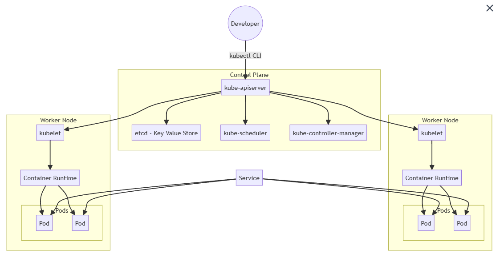
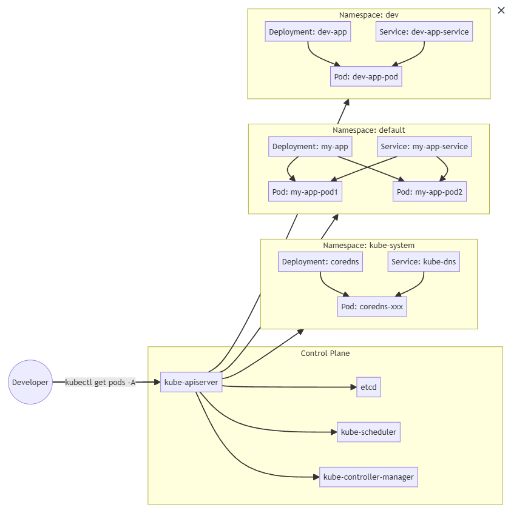

### Lifecycle

1. When a new app is deployed, the Control Plane places the Pods on appropriate Nodes
2. the kubelet on each Node ensures the Pods are healthy and running as instructed
3. Services route traffic to the correct Pods, allowing clients to access apps

### Benefits of Kubernetes

- 

- Why is Kubernetes needed

· Benefits of Kubernetes

· Success stories

· Kubernetes architecture (include a diagram)

· The cluster setup

o What is a cluster

o Master vs worker nodes

o Pros and cons of using managed service vs launching your own

o Control plane vs data plane

· Kubernetes objects

o Research the most common ones, e.g. Deployments, ReplicaSets, Pods

o What does it mean a pod is "ephemeral"

· How to mitigate security concerns with containers

· Maintained images

o What are they

o Pros and cons of using maintained images for your base container images

· Research and document the types of autoscaling available with K8s

- **Autoscaling:** a K8s feature allowing a cluster to increase/decrease the number of nodes or pod resources in response to demand
- 3 methods of autoscaling with K8s:
  1. **Horizontal Pod Autoscaler (HPA)**: automatically adds/removes pod replicas; by default, it checks the metrics (default: average CPU usage; or the custom metrics you define) every 15 seconds -- note that it CAN'T add new nodes, only Cluster Autoscaler can do this
  2. **Vertical Pod Autoscaler (VPA)**: automatically assigns/deassigns CPU & memory resources (i.e. reservations) for pods
  3. **Cluster Autoscaler**: automatically adds/removes nodes in a cluster based on pods' requested resources

**Courtesy of kubecost.com:**
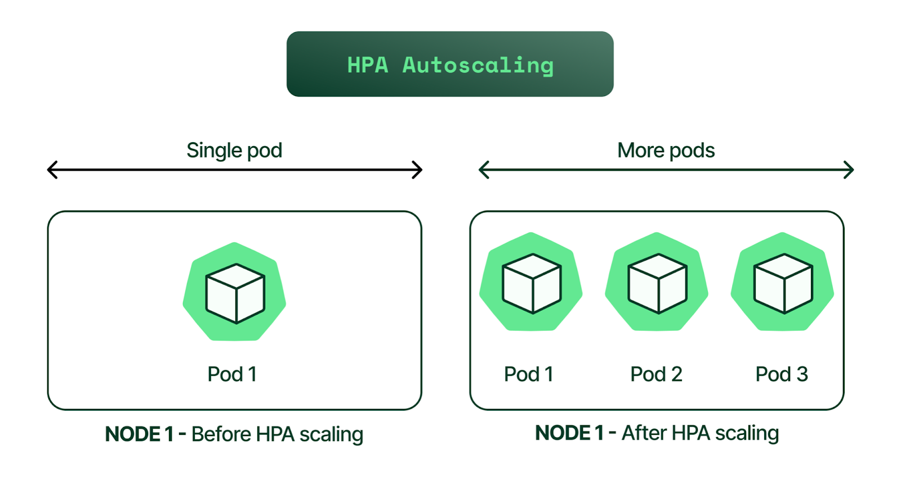
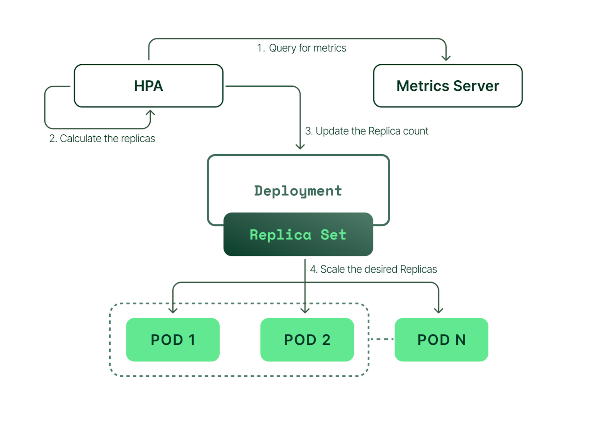
# Day 1 Tasks

## Get Kubernetes running using Docker Desktop

1. I ran `kubectl get service` and got this expected error 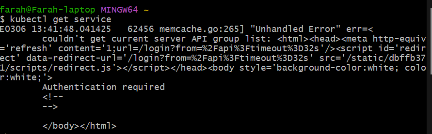
2. To solve this, I enabled Kubernetes in Docker Desktop 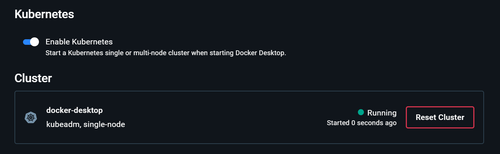
3. Successfully re-ran `kubectl get service` 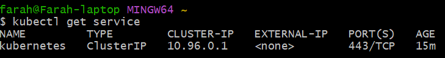

## Create Nginx deployment only

1. Created YAML file (link)
2. Ran `kubectl apply -f nginx-deploy.yml` to create the deployment 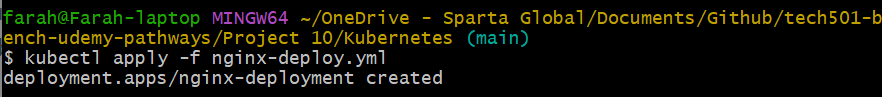
3. Ran `kubectl get deployment nginx-deployment` to get details on the deployment 
4. Ran `kubectl get replicaset` to get details on the replicasets 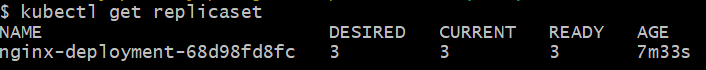
5. Ran `kubectl get pods` to get details on the pods 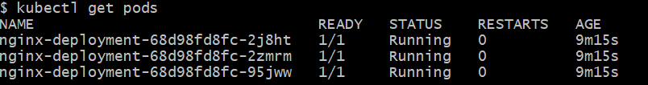
6. Ran `kubectl get all -l app=nginx` to see details on all three with one command 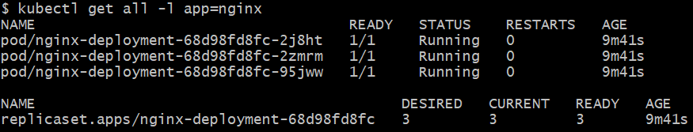
7. Tried to access my deployment via my web browser at localhost and ClusterIP but this didn't work (as expected), because the ClusterIP is a private IP address only accessible within the cluster

## Get a NodePort service running

1. Created yaml file
2. Created the service with `kubectl apply -f nginx-service.yml` 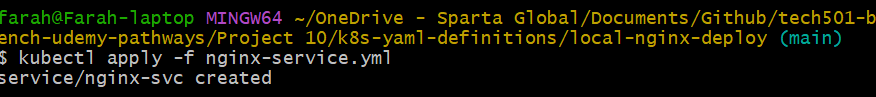
3. Ran `kubectl get svc nginx-svc` to get details on the service 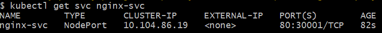
4. On my web browser, navigated to localhost:30001 to verify the NodePort service was running 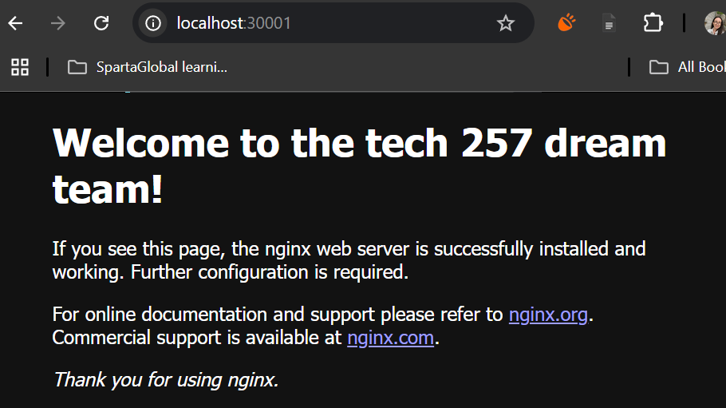 

## See what happens when we delete a pod

1. Ran `kubectl get pods` to list the pods 
2. Ran `kubectl delete pod nginx-deployment-68d98fd8fc-2j8ht` to delete one of the pods (in this case, the first pod) in the above list 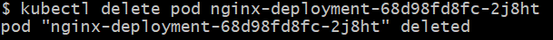
3. Re-ran `kubectl get pods` and saw that Kubernetes had automatically recreated a pod to satisfy the requirements in my deployment file 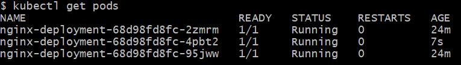
4. Ran `kubectl get pods --sort-by=.metadata.creationTimestamp` to get a list of pods by their time of creation 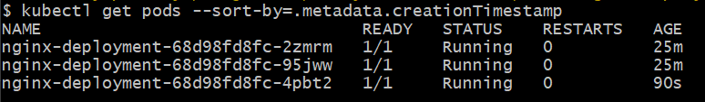
5. Ran `kubectl describe pod nginx-deployment-68d98fd8fc-4pbt2` to get detailed information on the newest pod
6. Automated this process with:
   1. Running `kubectl get pods --sort-by=.metadata.creationTimestamp -o jsonpath='{.items[-1].metadata.name}'` to get the name of the latest pod only (this is done by limiting the list via `items[-]` and extracting the name via `metadata.name`) 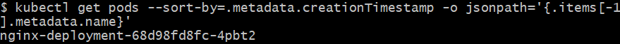
   2. Running `kubectl describe pod $(kubectl get pods --sort-by=.metadata.creationTimestamp -o jsonpath='{.items[-1].metadata.name}')` to get details on the newest pod -- this command uses the output of the above command as a variable) 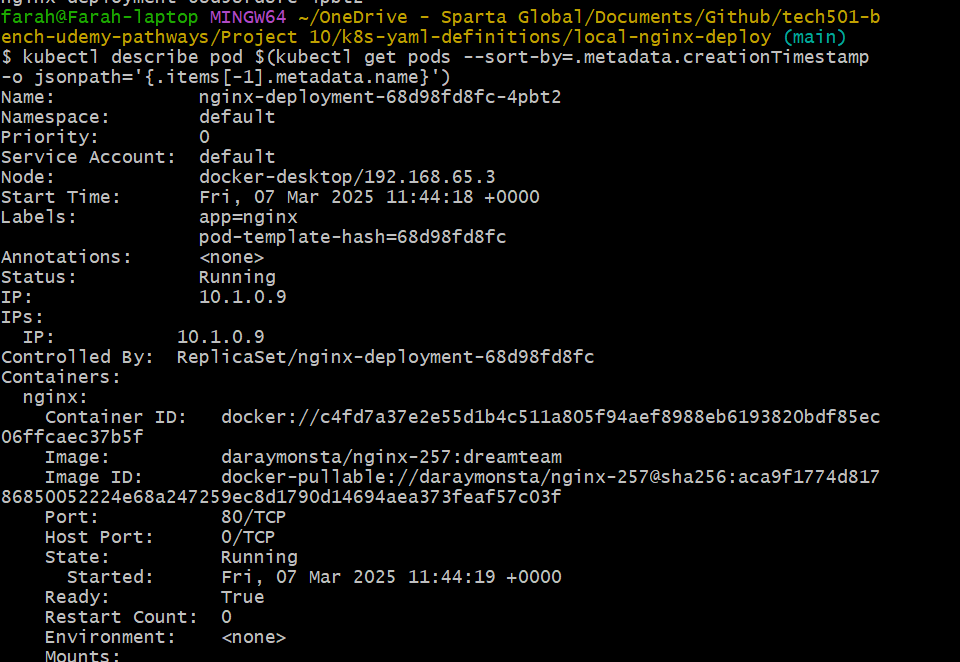

## Increase replicas with no downtime

- We want to be able to increase the number of replicas (pods) in our deployment in real-time, without needing to destroy and re-create our deployment

### Method 1: editing the deployment file in real-time

1. Ran `kubectl edit deployment nginx-deployment` -- this opened up an editable version of the in-use deployment file in Notepad, so I changed th e number of replicas to 4, saved (*Ctrl-S*), and exited the file 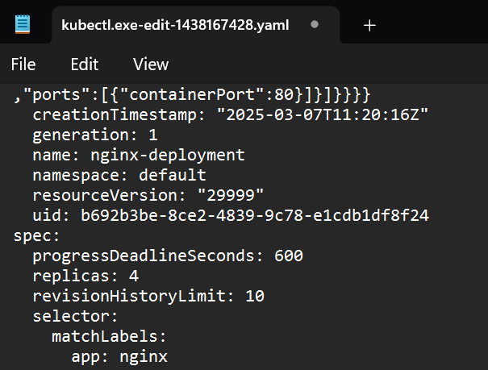 
2. I then ran `kubectl get pods` again and verified that there were now 4 pods running 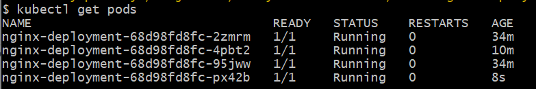

### Method 2: Apply a modified deployment file

1. Edited the *nginx-deploy.yml* file to change the number of replicas to 5
2. Applied the updated file by running `kubectl apply -f nginx-deploy.yml` again
3. Ran `kubectl get pods` again to verify that there were now 5 pods running 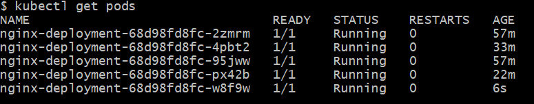

### Method 3: Use the scale command

1. I ran `kubectl scale deployment nginx-deployment --replicas=6` to scale this deployment by 1 more replica 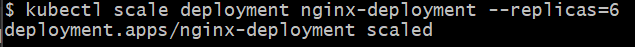
2. Ran `kubectl get pods` again to verify that there were now 6 pods running 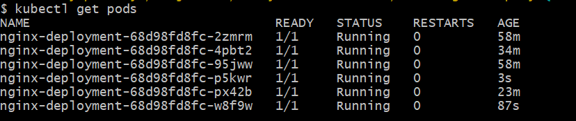

## Delete K8s deployments and services

1. Ran `kubectl delete -f nginx-deployment.yml` and `kubectl delete -f nginx-service.yml` to delete the Nginx deployment and service 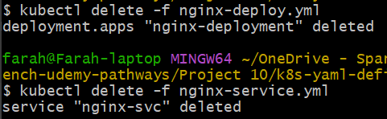
2. Ran `kubectl get all` to verify that they (and the ReplicaSets and pods) were deleted 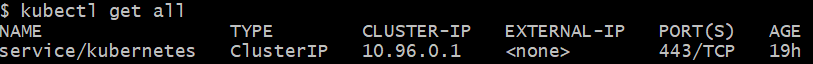

## K8s deployment of NodeJS Sparta test app

**ADD DIAGRAM HERE**

1. Created [*app-deploy.yml*](k8s-yaml-definitions/local-nodesj20-app-deploy/app-deploy.yml) and [*app-service.yml*](k8s-yaml-definitions/local-nodesj20-app-deploy/app-service.yml) files
2. Ran`kubectl apply -f app-deploy.yml` and `kubectl apply -f app-service.yml` to create these resources based on the above files
3. Navigated to *localhost:30002* (the port specified in my *app-service.yml* file) to verify that this was successful 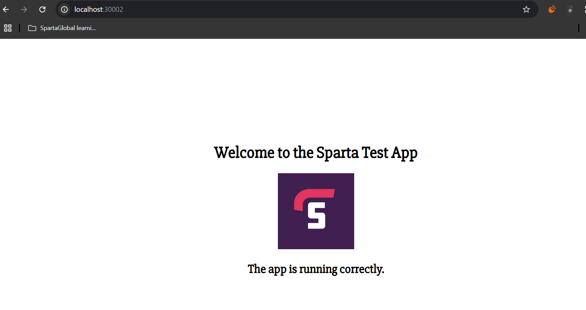
4. Created [*mongodb-service.yml*](k8s-yaml-definitions/local-nodejs20-app-deploy/local-mongodb-deploy/mongodb-service.yml) and [*mongodb-deploy.yml*](k8s-yaml-definitions/local-nodejs20-app-deploy/local-mongodb-deploy/mongodb-deploy.yml) files 
5. Ran `kubectl apply -f mongodb-deploy.yml` and `kubectl apply -f mongodb-service.yml` to create these resources based on the above files 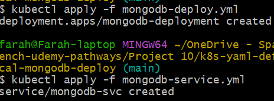
6. Navigated to *localhost:30002/posts* to verify the deployment and database connection was successful 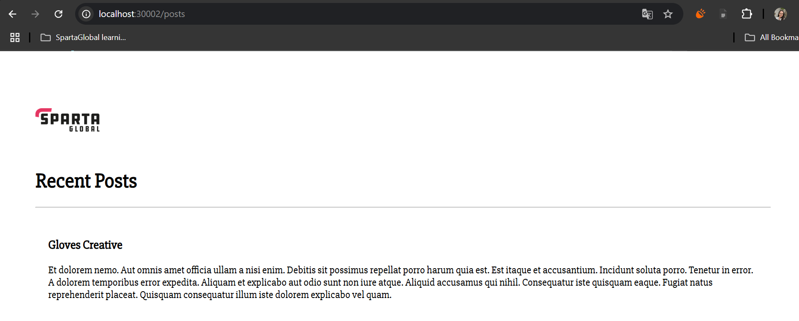

## **Blockers**

1. I had issues enabling Kubernetes with Docker Desktop as it hung on "Starting Kubernetes" for a long time; this seemed to be solved by manually installing Kubernetes via Chocolatey and then enabling Kubernetes again via Docker Desktop
2. After having to restart my laptop, I created the deployments again, but my posts page wasn't seeded (though I didn't receive any errors) -- I thought this might have been because either of my pods or services hadn't been fully initialised before the connection was made, so I resolved this by running `kubectl rollout restart deployment sparta-app-deployment` to restart the app deployment -- this worked (note the new record, indicating a re-seeding has taken place) 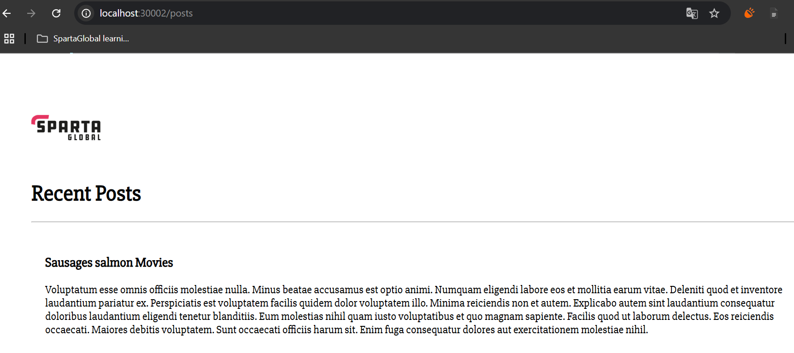

# Day 2 Tasks

## Create 2-tier deployment with a PersistentVolume (PV) for the database

- using a PersistentVolume ensures the data will be retained even if the MongoDB pod restarts
- a PersistentVolumeClaim (PVC) requests a certain amount storage form the PV for a Pod

1. Created a mongo-pv.yml and a mongo-pvc.yml file (link)
2. Created the PV with `kubectl apply -f mongo-pv.yml`
3. Created the PVC with `kubectl apply -f mongo-pv.yml` 
4. Verified they were both created successfully 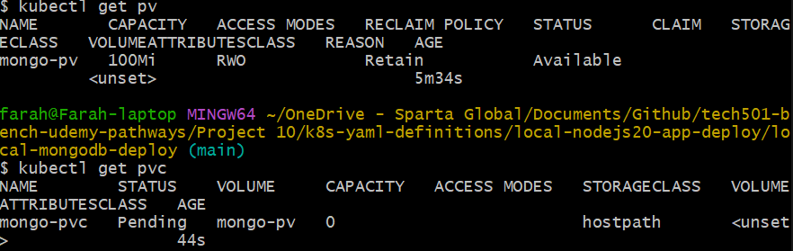
- For reference, this is what my *localhost:30002/posts* page looked like at this point 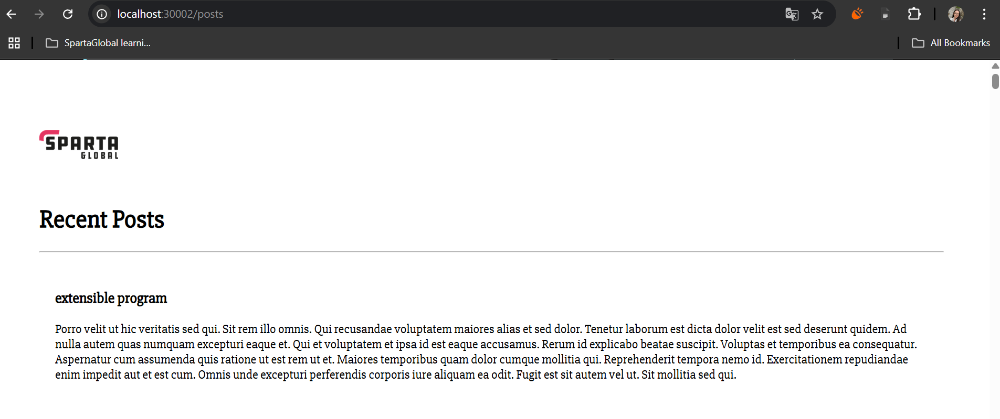
5. Deleted my database deployment with `kubectl delete deployment mongo-deployment` 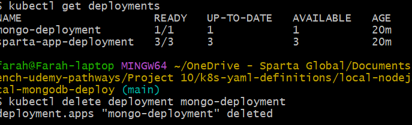
6. Verified that my *posts* page no longer worked 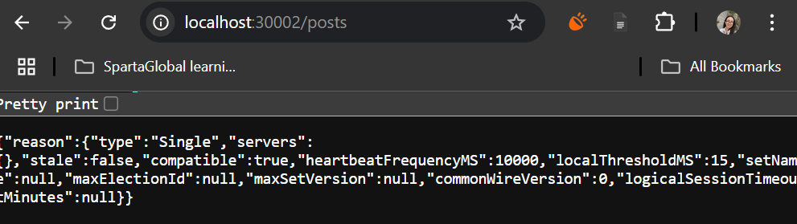
7. Recreated it with `kubectl apply -f mongo-deploy.yml` and visited *localhost:30002/posts* again to verify that the records were still the same 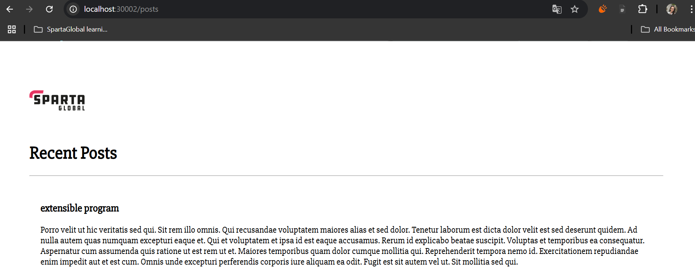


**Diagram your Kubernetes architecture with the PV and PVC**
**a. Have logical notes/dot points on your diagram, labels**


## Use Horizontal Pod Autoscaler (HPA) to scale the app

1. Installed Metrics server with `kubectl apply -f https://github.com/kubernetes-sigs/metrics-server/releases/latest/download/components.yaml`
2. Created a HPA with `kubectl autoscale deployment sparta-app-deployment --cpu-percent=5 --min=2 --max=10` 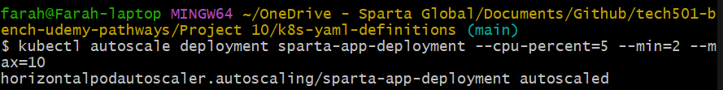
3. Verified it was running with `kubectl get hpa` !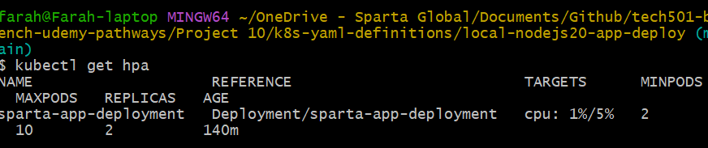
4. Installed Apache Benchmark on Windows by downloading Apache 2.4.63-250207 Win64 from [Apache Lounge](https://www.apachelounge.com/download/) and adding it to the PATH environment variable 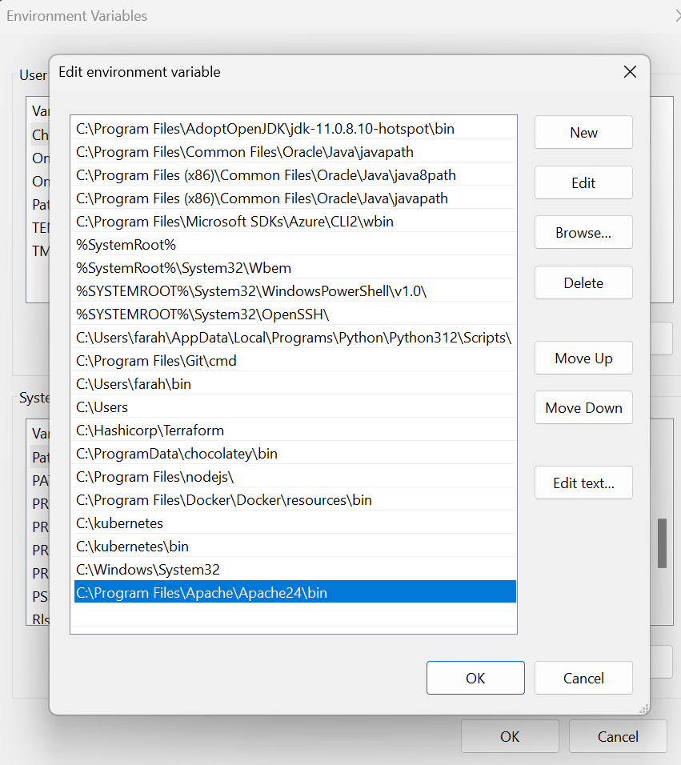
   -  I verified it was installed with `ab -V` 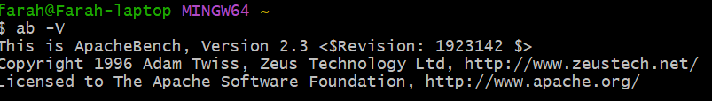
5. Ran this `ab -n 10000 -c 1000 http://localhost:30002/`
6. Watched the CPU activity with `kubectl get hpa -w` 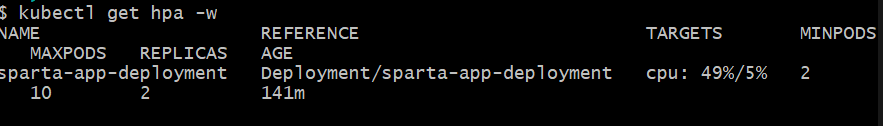
7. Verified that pods were being created with `kubectl get pods` 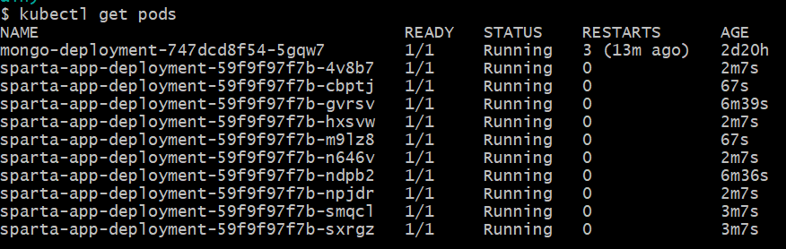
   - and also with `kubectl describe deployment sparta-app-deployment` (note the instances of "Scaled up") 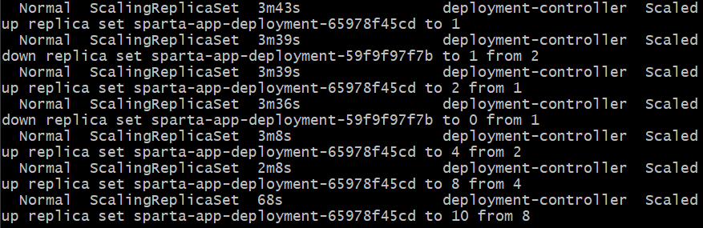
9. I waited a little while for the cooldown period to be over so that the HPA started scaling down again 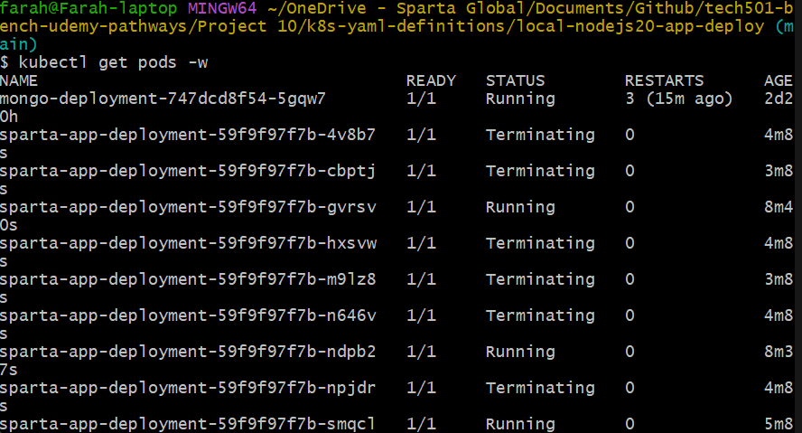
10. Also verified with `kubectl describe deployment sparta-app-deployment` 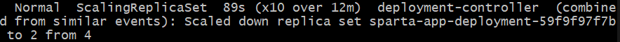
11. note that HPA minimums take precedence over the number of replicas defined in my app-deploy.yml, which is why I now only have 2 app pods 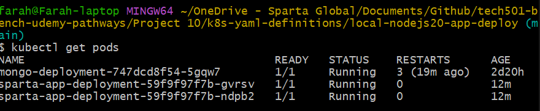
    1.  I repeated these steps by running `ab -n 1000 -c 100 http://127.0.0.1:30002/` 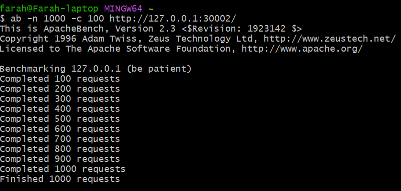
    2.  When running `kubectl get pods -w` 
    3.  And verifying only 2 pods left again after 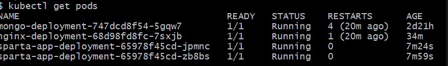
    4.  And with `kubectl describe deployment sparta-app-deployment` 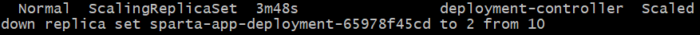
  
## Extension task: Remove PVC and retain data in Persistent Volume

1. 

## **Blockers**

1. I had blockers getting my Metrics Server and HPA to work, because it would say unknown/5% (which was the metric I set); I got around this by adding a resource block to my app-deploy.yml, deleting the pods, and then trying again
2. For some reason, during the HPA task, *localhost:30002* stopped showing the app, but *127.0.0.1:30002* did, so I edited *C:\Windows\System32\drivers\etc\hosts* to uncomment *127.0.0.1 localhost* 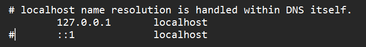 and restarted my laptop, and this resolved the issue for a time 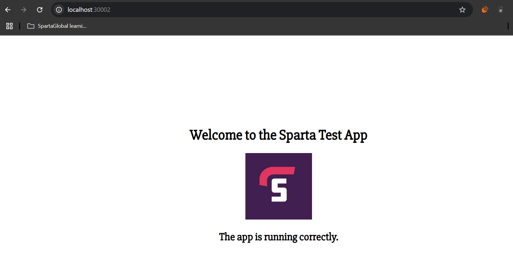
   - However it reoccurred after running the `ab` command on `localhost:30002`, so after troubleshooting unsuccessfully I just reverted to using `127.0.0.1:30002` in my commands and browser instead

# Day 3 Tasks 

## Setup minikube on a cloud instance running Ubuntu 22.04 LTS

1. Created a t3a.small EC2, Ubuntu 22.04 LTS EC2 named tech501-farah-kubernetes-minikube-ec2, inbound access on port 9000 from anywhere 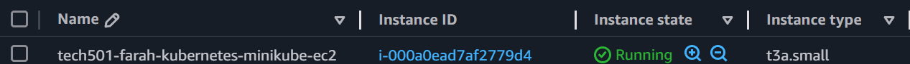
2. Ran `sudo apt update && sudo apt upgrade -y`
3. Installed Nginx with `sudo apt install nginx`
4. Installed and configured Docker (a dependency):
```
sudo apt install -y apt-transport-https curl virtualbox docker.io
sudo systemctl enable docker
sudo systemctl restart docker
```
1. Installed and configured Minikube
```
curl -LO https://storage.googleapis.com/minikube/releases/latest/minikube-linux-amd64
sudo mv minikube-linux-amd64 /usr/local/bin/minikube
sudo chmod +x /usr/local/bin/minikube
```
1. Verified Minikube was installed with `minikube version` 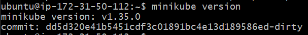
2. Added myself to the Docker group with `sudo usermod -aG docker $USER && newgrp docker` so that I could run the next command
3. Installed `kubectl` following [these steps](https://kubernetes.io/docs/tasks/tools/install-kubectl-linux/)
```
  curl -LO "https://dl.k8s.io/release/$(curl -L -s https://dl.k8s.io/release/stable.txt)/bin/linux/amd64/kubectl"
  url -LO "https://dl.k8s.io/release/$(curl -L -s https://dl.k8s.io/release/stable.txt)/bin/linux/amd64/kubectl.sha256"
  echo "$(cat kubectl.sha256)  kubectl" | sha256sum --check
  sudo install -o root -g root -m 0755 kubectl /usr/local/bin/kubectl
```
4. Installed Metrics server with `kubectl apply -f https://github.com/kubernetes-sigs/metrics-server/releases/latest/download/components.yaml`

## Deploy on three apps on one cloud instance running minikube

### First app

1. Started Minikube with `minikube start`
2. Created Nginx deployment and service files (LINK)
3. Applied them with `minikube kubectl -- apply -f first-deployment.yml` and `minikube kubectl -- apply -f first-service.yml` 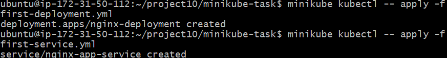
4.  Noted Minikube's IP address with `minikube ip` 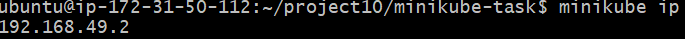
5.  Replaced the try_files line with a proxy pass line in Nginx's sites-available/default file so it looked like this 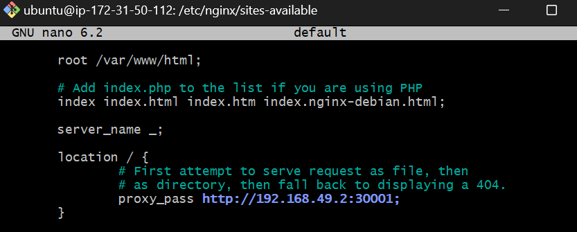
6.  Verified the syntax was okay with `sudo nginx -t` 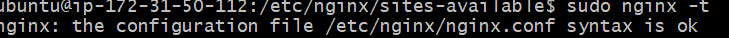
7.  Reloaded Nginx with `sudo systemctl reload nginx`
8.  In my browser, navigated to this EC2's public IP and verified that the app was running 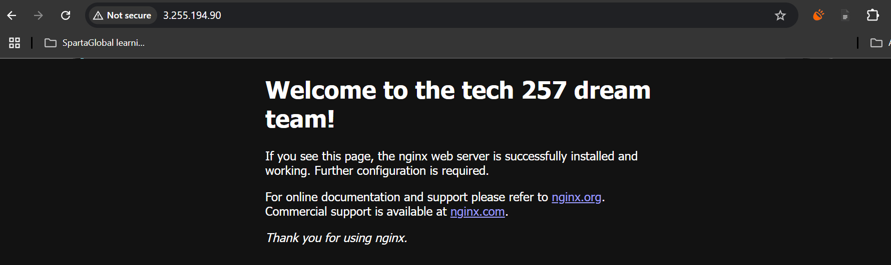 

### Second app

1. Created second-deployment.yml
2. Applied with `minikube kubectl -- apply -f second-deployment.yml` 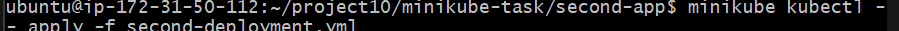
3. Created second-service.yml
4. Applied with `minikube kubectl -- apply -f second-service.yml` 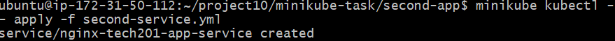
5. Added a new *server* block to Nginx's default file 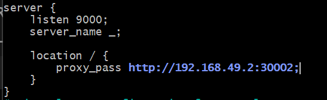
6. Verified the syntax was okay with `sudo nginx -t` 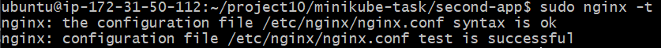
7. Reloaded Nginx with `sudo systemctl reload nginx`
8. Ran `minikube tunnel` 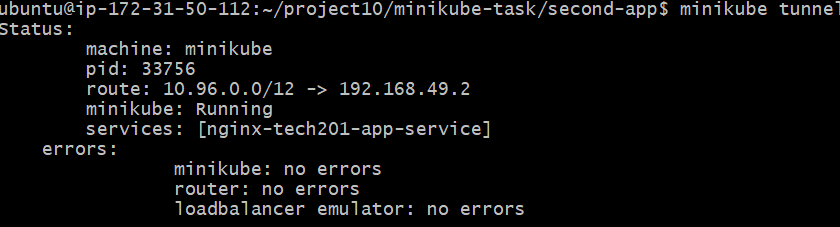
9. Verified this process was successful by navigating to http://3.255.194.90:9000/ 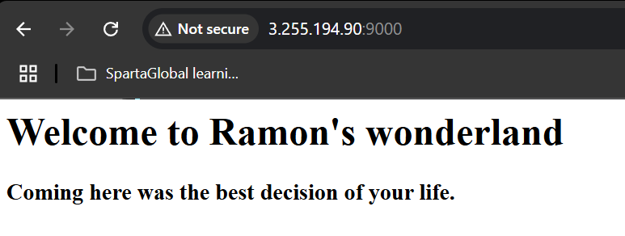

### Third deployment

1. Ran `sudo snap install kubectl --classic` to enable me to install `kubectl` and follow the steps on [the hello-minikube tutorial](https://kubernetes.io/docs/tutorials/hello-minikube/) 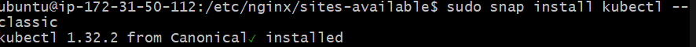
2. Ran `kubectl create deployment hello-node --image=registry.k8s.io/e2e-test-images/agnhost:2.39 -- /agnhost netexec --http-port=8080` 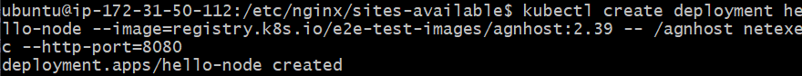
3. Verified that the deployment was created with `kubectl get deployments` 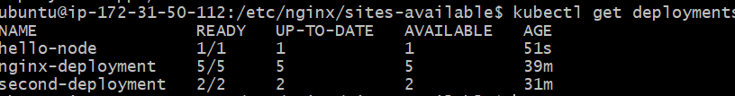
4. Verified that the pod had been created with `kubectl get pods` 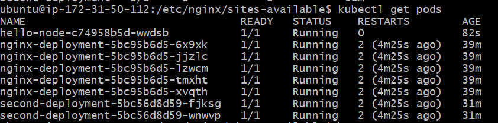
5. Exposed the pod to port 8080 with `kubectl expose deployment hello-node --type=LoadBalancer --port=8080` 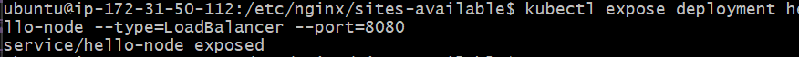
6. Verified that the service had been created with `kubectl get services` 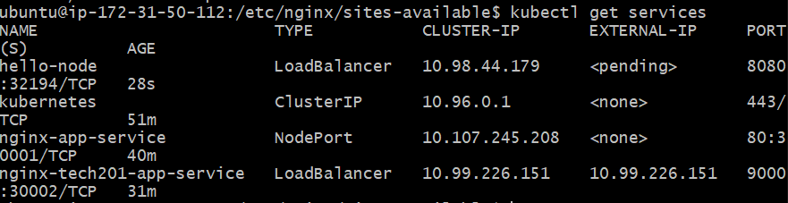
7. Ran `minikube service hello-node` 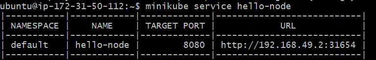 (normally this would open a browser window to serve the app, but it didn't because I don't have a browser on this VM)
8. Ran curl command to verify the app was running on the URL in above command's output 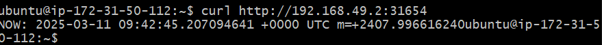
9. Configured Nginx 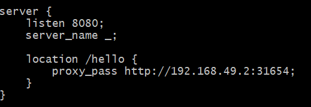 (provisional)
10. Output 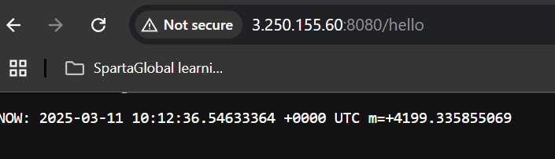


· In your documentation, include:

o Specifics on how and why use minikube tunnel

o How you cleanup and remove each deployment

o How to get Kubernetes working again after restarting the cloud instance


1. Created files (exact same as in this folder)
2. Applied them all
3. Ran minikube tunnel
4. Configured reverse proxy using minikube IP 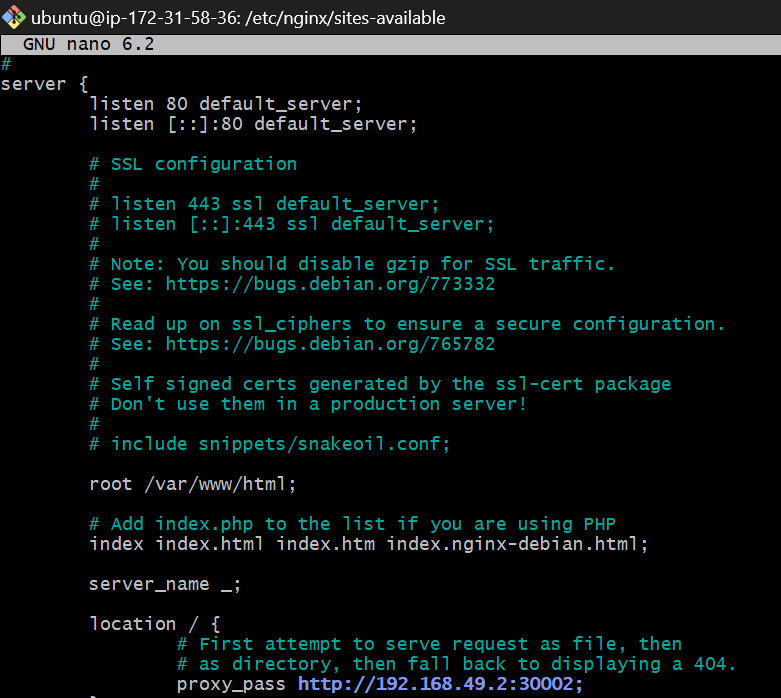
5. Tested app front page 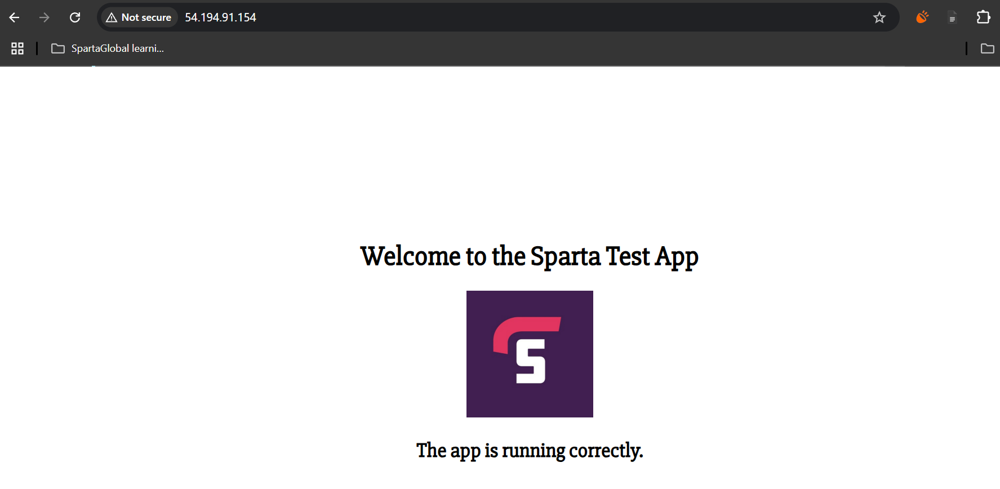
6. Tested posts page 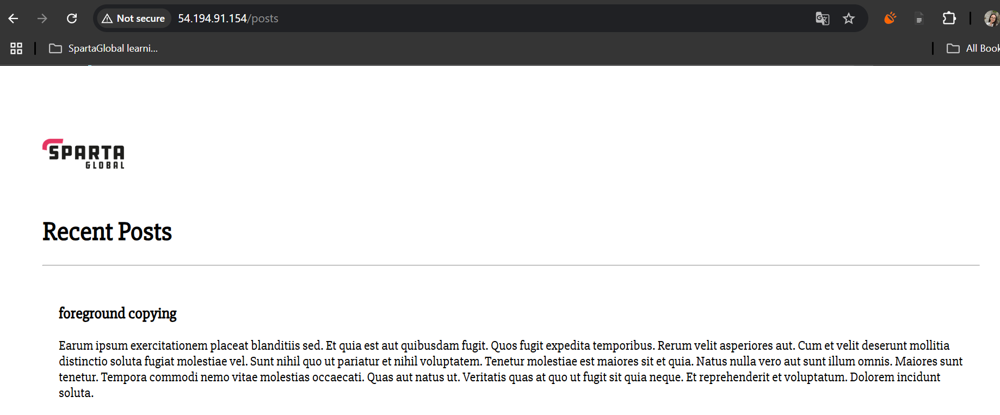
7. Created a HPA with `kubectl autoscale deployment sparta-app-deployment --cpu-percent=5 --min=2 --max=10` 
  


## Use Kubernetes to deploy the Sparta test app in the cloud

- created a new ec2 named *tech501-farah-kubernetes-2tier-minikube-ec2*
- added 12gb


 
1. Verified it was running with `kubectl get hpa` 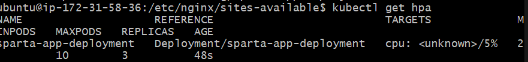
2. Installed Apache Benchmark with `sudo apt install apache2-utils` 
   -  I verified it was installed with `ab -V` 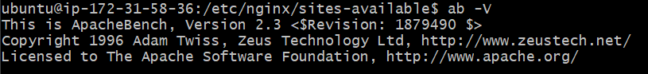 
3. Ran this `ab -n 6000 -c 100 http://54.194.91.154/
`
4. Watched the CPU activity with `kubectl get hpa -w` 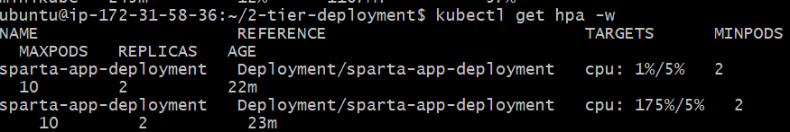
5. Verified that pods were being created with `kubectl get pods` 
   - and also with `kubectl describe deployment sparta-app-deployment` (note the instances of "Scaled up") 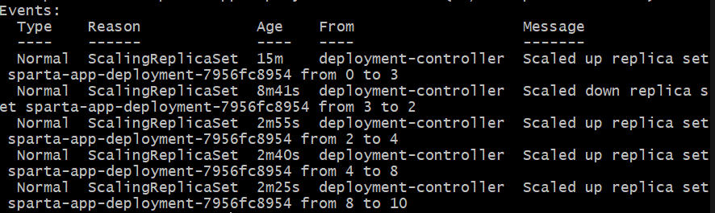
6. I waited a little while for the cooldown period to be over (which seemed to be around 9 minutes after the scaled pods were created) so that the HPA started scaling down again 
  - Also verified with `kubectl describe deployment sparta-app-deployment` 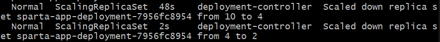
7. Again, note that HPA minimums take precedence over the number of replicas defined in my app-deploy.yml, which is why I now only have 2 app pods 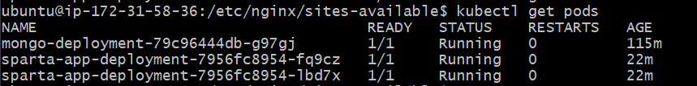
8. To make Minikube start on the reboot of my instance, I:
   1. Created file
   2. Ran daemon
   3. ran enable
   4. ran restart
   5. ran status 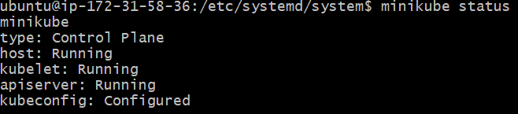
   6. To test this, I then stopped my EC2 instance, started it, logged in, and ran `sudo systemctl status minikube` 


 
  
## **Blockers**

1. I had issues with the Metrics Server 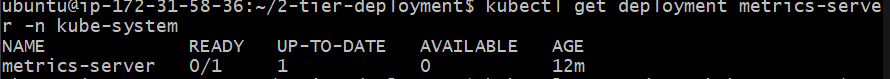 ran `kubectl logs -n kube-system metrics-server-6f7dd4c4c4-lfq48` saw 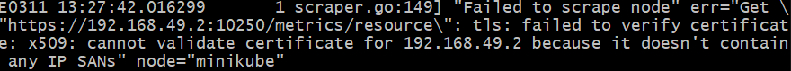 , apparently this is common when running minikube
   1. so I  had to run `kubectl edit deployment metrics-server -n kube-system` and add `- --kubelet-insecure-tls` under `spec.containers.args` -- once the old metrics server was deleted a new one was created, commands like `kubectl top nodes` worked 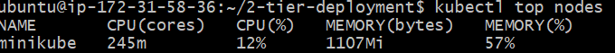
2. Had issues with the very last task, so to undo my attempts I ran
```
sudo systemctl stop minikube
sudo systemctl disable minikube
sudo rm /etc/systemd/system/minikube.service
sudo systemctl daemon-reload

sudo systemctl restart docker
 
minikube delete
minikube start --driver=docker

minikube status
```


# What I learnt

- 

# Benefits I personally saw from the project

- 