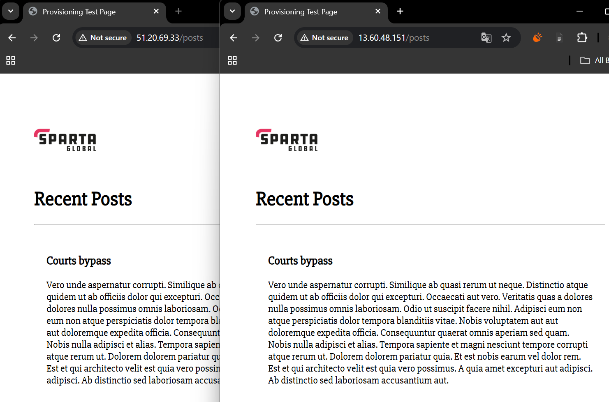

## Steps for setup in GCP

- need to add playbook tasks to install Git and Nano
- need to add the SSH key to project-wide metadata for the compute engines so that the Ansible controller can SSH in
- if you get with a `WARNING: REMOTE HOST IDENTIFICATION HAS CHANGED!` error after previously successfully SSHing into a target VM from the Ansible controller, run `ssh-keygen -f "/home/fcheded/.ssh/known_hosts" -R "35.233.85.9"` (change IP to that of the target VM) and try again