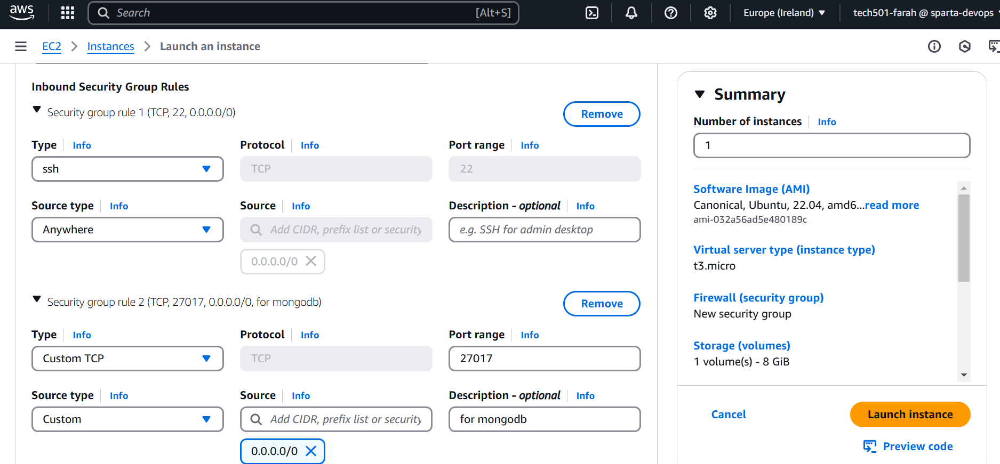
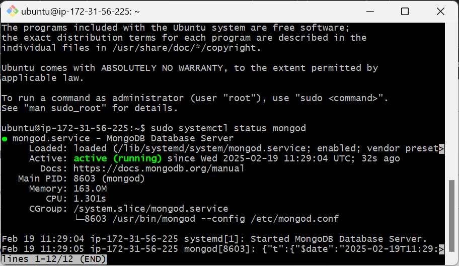
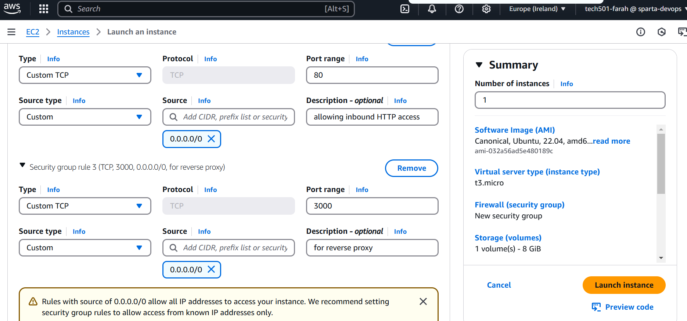
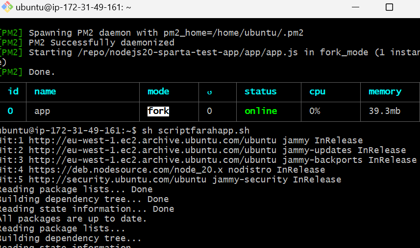

# Project 7

- [Project 7](#project-7)
  - [Task](#task)
  - [Part 1a — provisioning the DB instance](#part-1a--provisioning-the-db-instance)
    - [What I learnt](#what-i-learnt)
  - [Part 1b — provisioning the app instance](#part-1b--provisioning-the-app-instance)
    - [What I learnt](#what-i-learnt-1)

## Task

- [Task instructions here](https://testingcircle.sharepoint.com/:w:/r/sites/SpartaGlobalHO/_layouts/15/Doc.aspx?sourcedoc=%7BBA72D0CB-2B42-4267-87D0-FA9D48AFDC01%7D&file=DevOps%20Project%207%20Brief%20-%20Use%20Scripting%20and%20User%20Data%20for%202-Tier%20App%20Deployment.docx&action=default&mobileredirect=true)
1. Part 1:
  1. develop script to provision the DB VM/instance
  2. develop script to provision the Sparta test app VM/instance
2. Part 2
3.  

## Part 1a — provisioning the DB instance

1. I created [a script file](prov-db.sh) that did not need user input and used the `sed` command to change MongoDB's BindIP setting to 0.0.0.0
2. I then used AWS's GUI to create an instance:
  - **Name**: *tech501-farah-udemy-project7-db-from-script-ec2*
  - **AMI**: Ubuntu 22.04 LTS (HVM), SSD volume type
  - **Instance type**: t3.micro
  - **Key pair**: my AWS key
  - **Network**: default VPC
  - **Security rules**:
    - allowed SSH (this is done **by default**)
    - **added a new rule** to allow traffic on port 27017 (for mongoDB) from all sources

  - **Advanced details**:
    - I scrolled down to **User data,** then pasted in the contents of [this script file](prov-db.sh)
3. **Launched instance**
4. Waited 5 minutes
5. Tested with `sudo systemctl status mongod`:
 
6. Tested the idempotency of my script by running it again
   - as the downgraded message shows, the script ran the `upgrade` command (which upgraded mongodb) and then downgraded my version of mongodb to the version specified in my command

   - and this shows that mongodb was restarted afterwards
  

### What I learnt

- the `sed` command syntax for replacing a string in a given file is:
`sudo sed -i 's/<string to remove>/<string to add in its place>' <file path to do this in>`
  - the `-i` flag tells the `sed` command to write the results of the command to a file, not just to output it to the terminal 

## Part 1b — provisioning the app instance

1. I created [a script file](prov-app.sh) that did not need user input
2. I then used AWS's GUI to create an instance using the same steps as above, except:
  - **Name**: *tech501-farah-udemy-project7-app-from-script-ec2*
  - **Security rules**:
    - allowed SSH (this is done **by default**)
    - **added a new rule** to allow inbound HTTP access (i.e. port 80) and inbound access on port 3000 (for reverse proxy)

  - **Advanced details**:
    - I scrolled down to **User data,** then pasted in the contents of [this script file](prov-app.sh) which includes the `export` command containing the private IP of the above created DB EC2
3. **Launched instance**
4. Wait 5 minutes for the commands to run (they were running a little slowly for me)
5. Tested by navigating to the public IP of this app EC2:

6. Tested my posts page:

7. Tested the idempotency of my script by running it twice when the app was already running

   - and it started the app again 

### What I learnt

- in my `sed` command to configure the reverse proxy, I needed to switch to | for the command delimiter because / in the string confused it:
`sudo sed -i 's|try_files $uri $uri/ =404;|proxy_pass http://localhost:3000;|' /etc/nginx/sites-available/default`
- I needed to change ownership of the newly git-cloned repo folder because otherwise it wouldn't let me run `npm install`
- I needed to add an `npm audit fix` command to my script to remove some errors that I couldn't get past otherwise
- I needed to add a `node seeds/seed.js` command in case my */posts* page hadn't been seeded properly