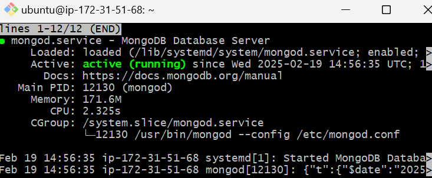
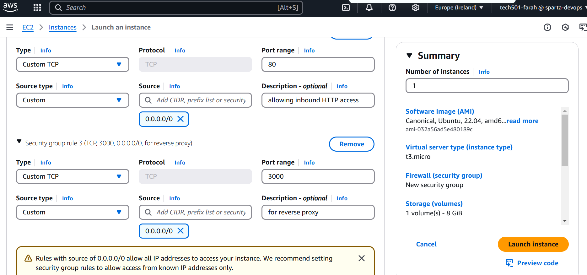
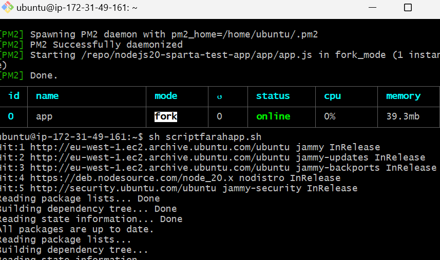
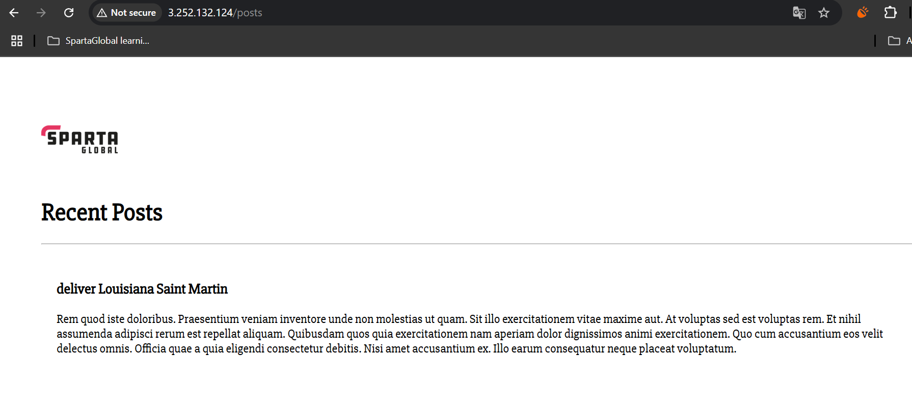
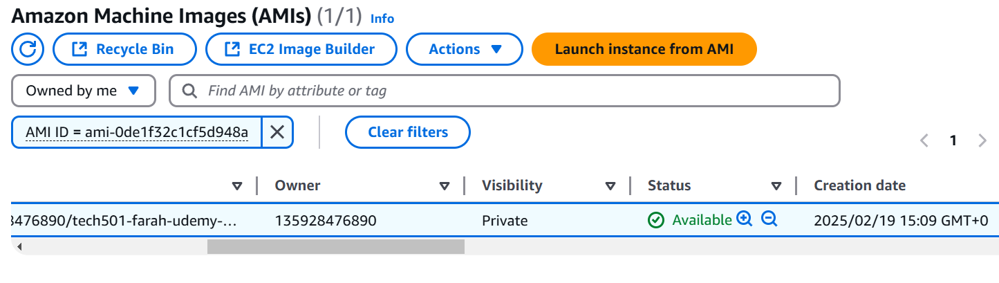
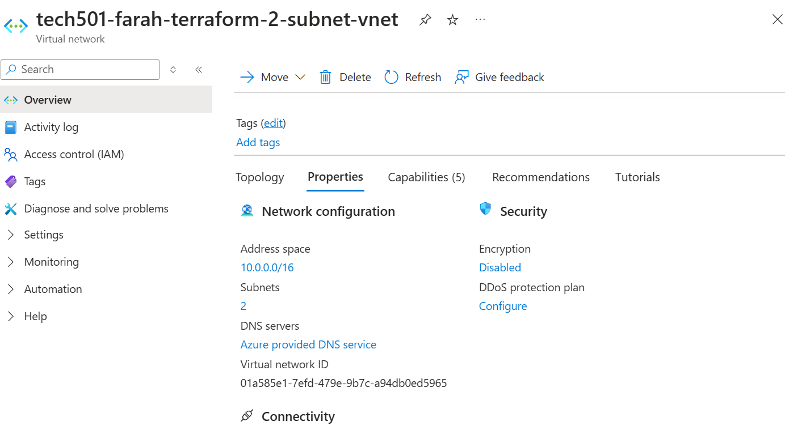
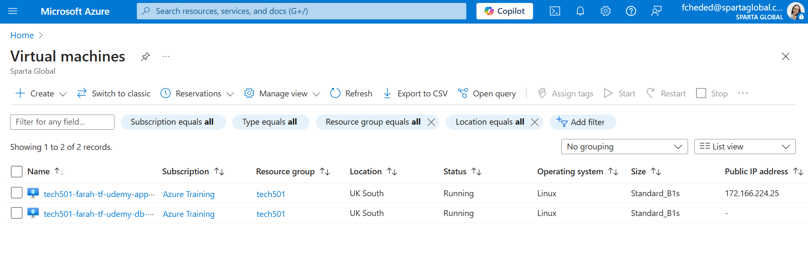
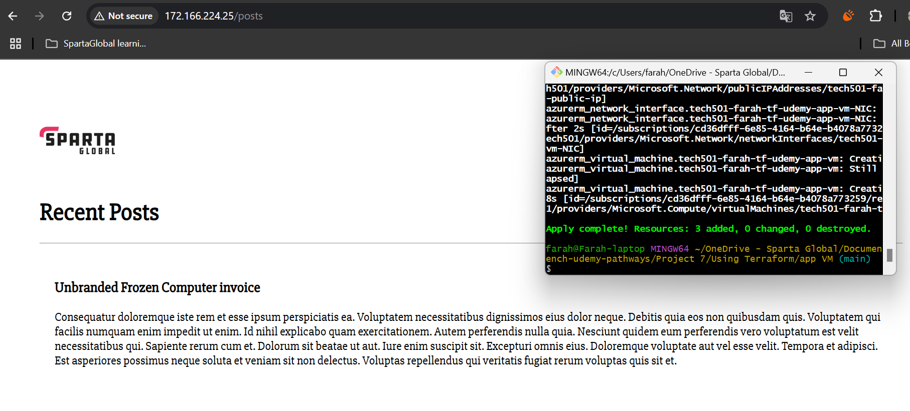

# Project 7

- [Project 7](#project-7)
  - [Task](#task)
  - [Part 1a — provisioning the DB instance](#part-1a--provisioning-the-db-instance)
    - [What I learnt](#what-i-learnt)
  - [Part 1b — provisioning the app instance](#part-1b--provisioning-the-app-instance)
    - [What I learnt](#what-i-learnt-1)
  - [Part 2a — creating and testing an image of the above DB EC2 instance](#part-2a--creating-and-testing-an-image-of-the-above-db-ec2-instance)
    - [What I learnt](#what-i-learnt-2)
  - [Part 2b — creating and testing an image of the above app EC2 instance](#part-2b--creating-and-testing-an-image-of-the-above-app-ec2-instance)
    - [What I learnt](#what-i-learnt-3)
  - [Bonus part 3](#bonus-part-3)
    - [What I learnt](#what-i-learnt-4)

## Task

- [Task instructions here](https://testingcircle.sharepoint.com/:w:/r/sites/SpartaGlobalHO/_layouts/15/Doc.aspx?sourcedoc=%7BBA72D0CB-2B42-4267-87D0-FA9D48AFDC01%7D&file=DevOps%20Project%207%20Brief%20-%20Use%20Scripting%20and%20User%20Data%20for%202-Tier%20App%20Deployment.docx&action=default&mobileredirect=true)
1. **Step 1**:
     1. Develop script to provision the DB VM/instance via User Data
     2. Develop script to provision the Sparta test app VM/instance via User Data
2. **Step 2**:
   1. Create and test an image of my DB EC2
   2. Develop a *run-app-only.sh* script just to run the app on an app EC2 that will be created in below step
   3. Create and test an image of my app EC2 using the *run-app-only.sh* script
3.  

---

## Part 1a — provisioning the DB instance

1. I created [a script file](prov-db.sh) that did not need user input and used the `sed` command to change MongoDB's BindIP setting to 0.0.0.0
2. I then used AWS's GUI to create an instance:
  - **Name**: *tech501-farah-udemy-project7-db-from-script-ec2*
  - **AMI**: Ubuntu 22.04 LTS (HVM), SSD volume type
  - **Instance type**: t3.micro
  - **Key pair**: my AWS key
  - **Network**: default VPC
  - **Security rules**:
    - allowed SSH (this is done **by default**)
    - **added a new rule** to allow traffic on port 27017 (for mongoDB) from all sources

  - **Advanced details**:
    - I scrolled down to **User data,** then pasted in the contents of [this script file](prov-db.sh)
3. **Launched instance**
4. Waited 5 minutes
5. Tested with `sudo systemctl status mongod`:
 
6. Tested the idempotency of my script by running it again
   - as the downgraded message shows, the script ran the `upgrade` command (which upgraded mongodb) and then downgraded my version of mongodb to the version specified in my command

   - and this shows that mongodb was restarted afterwards
  

### What I learnt

- the `sed` command syntax for replacing a string in a given file is:
`sudo sed -i 's/<string to remove>/<string to add in its place>' <file path to do this in>`
  - the `-i` flag tells the `sed` command to write the results of the command to a file, not just to output it to the terminal 

---

## Part 1b — provisioning the app instance

1. I created [a script file](prov-app.sh) that did not need user input
2. I then used AWS's GUI to create an instance using the same steps as above, except:
  - **Name**: *tech501-farah-udemy-project7-app-from-script-ec2*
  - **Security rules**:
    - allowed SSH (this is done **by default**)
    - **added new rules** to allow inbound HTTP access (i.e. port 80) and inbound access on port 3000 (for reverse proxy)

  - **Advanced details**:
    - I scrolled down to **User data,** then pasted in the contents of [this script file](prov-app.sh) which includes the `export` command containing the private IP of the above created DB EC2
3. **Launched instance**
4. Wait 5 minutes for the commands to run (they were running a little slowly for me)
5. Tested by navigating to the public IP of this app EC2:

6. Tested my posts page:

7. Tested the idempotency of my script by running it twice when the app was already running

   - and it started the app again 

### What I learnt

- in my `sed` command to configure the reverse proxy, I needed to switch to | for the command delimiter because / in the string confused it:
`sudo sed -i 's|try_files $uri $uri/ =404;|proxy_pass http://localhost:3000;|' /etc/nginx/sites-available/default`
- I needed to change ownership of the newly git-cloned repo folder because otherwise it wouldn't let me run `npm install` without `sudo`
  - However I retained the `sudo`
- I needed to add an `npm audit fix` command to my script to remove some errors that I couldn't get past otherwise
- I needed to add a `node seeds/seed.js` command in case my */posts* page hadn't been seeded properly

---

## Part 2a — creating and testing an image of the above DB EC2 instance

1. Log out of DB EC2 if logged in
2. Create an image from the EC2:
   - **Name**: *tech501-farah-udemy-db-from-script*

1. Check the image shows as available on the AMI dashboard

1. Create EC2 from image:
   1. **Name**: *tech501-farah-udemy-project-7-db-from-image*
   2. **Image**: should have already selected *tech501-farah-udemy-db-from-script*
   3. **Instance type**: t3.micro
   4. **Key pair**: mine
   5. **Network**: default VPC
   6. **Security rules**:
    - allowed SSH (this is done **by default**)
    - **added a new rule** to allow traffic on port 27017 (for mongoDB) from all sources
   7. Logged into the EC2 as Ubuntu and ran `sudo systemctl status mongod`

### What I learnt

- When logging into the EC2 created from my image, I needed to specify that I wanted to login as the `ubuntu` user like this:
`ssh -i "tech501-farah-aws-key.pem" ubuntu@ec2-3-249-254-177.eu-west-1.compute.amazonaws.com`
  - Otherwise I got this error

---

## Part 2b — creating and testing an image of the above app EC2 instance

1. Log out of app EC2 if logged in
2. Create an image from the EC2:
   - **Name**: *tech501-farah-udemy-app-from-script*

3. Check the image shows as available on the AMI dashboard

4. Create EC2 from image:
   1. **Name**: *tech501-farah-udemy-project-7-app-from-image*
   2. **Image**: should have already selected *tech501-farah-udemy-app-from-script*
   3. **Instance type**: t3.micro
   4. **Key pair**: mine
   5. **Network**: default VPC
   6. **Security rules**:
    - allowed SSH (this is done **by default**)
    - **added new rules** to allow inbound HTTP access (i.e. port 80) and inbound access from anywhere on port 3000 (for reverse proxy)
   7. In **User data**, added *run-app-only.sh* script [found here](run-app-only.sh)
   8. Went to the public IP of the app EC2, and confirmed that the app works
   9. Also created a *run-app-only.sh* script on the app EC2, and ran it twice to show that it is idempotent

5. I followed the steps above again to create another app EC2 and tested it; it worked

6. I also logged out of this second app EC2, logged back in, created a local *run-app-only.sh* script, ran it, and it worked perfectly (note the new records to indicate the reseeding of the database)

7. I also navigated to the app EC2's URL to test it worked without a browser cache and it did
 

### What I learnt

- That if I added a `node seeds/seed.js` command into my *run-app-only.sh* script (as well as the prov-app.sh script), I could be sure that the script was running successfully because the records on the */posts* page would be different — this helped me ensure the scripts really were running successfully, and not just being stored in my browser's cache
- That the private IP of an EC2 instance doesn't change after it has been restarted so my *run-app-only.sh* script can be used repeatedly without modifying it so long as I am working with the same DB EC2 (i.e. haven't created another one)
- Only the public IP changes on reboot on AWS (unless we have an elastic IP)
- I modified my run-app-only.sh script so that, before the `pm2 start app.js` line, it ran `pm2 delete app.js` to remove the app from pm2's process list, which seemed to be causing errors when rerunning the script — this is to ensure the script is idempotent

## Bonus part 3

1. After I successfully completed the above parts using AWS and its GUI, I wanted to redo the task on Azure using Terraform to set up the 2-subnet VN and the two VMs
   - The *.tf* files used for this part can be found [here](<Using Terraform>) (with sensitive information hidden in a git-ignored variable file)
2. VN created using this method:

3. VMs created using this method:
  
   - Successful posts page using this method:
  
4. I then created images of both the above VMs e.g.:

6. Using Terraform, I then created VMs from both of these images (with an added *run-app-only.sh* script provided as **custom data** for the app VM):
 
7. Tested these VMs from images by accessing the posts page:

### What I learnt

- During this part, I modified my script files so that each command run provided output to a log file — this helped in the initial stages, when I had to troubleshoot whether all the commands were running successfully
- Though the process of creating Azure VMs on Terraform is longer than it would have been had I used Terraform with AWS, I preferred this process because it was automated and repeatable
- I also preferred using Azure over AWS in general because, during testing (when I assigned a public IP to the MongoDB VM to enable manual logging in to check), I didn't have to modify the connection string used in the `export` command on the app VM
- Because of this, in future, if I was creating something with **an IP address I needed to keep the same** (e.g. a VM for a Jenkins server) and I didn't have access to an Elastic IP on AWS, I would prefer to use Azure — because we discovered that AWS's changing IP address caused Jenkins to work very slowly after a reboot of the EC2 it was running on