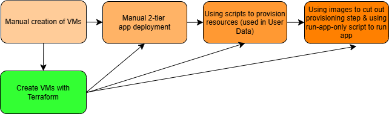

# **Project 7: Bash scripting**

- [**Project 7: Bash scripting**](#project-7-bash-scripting)
  - [GitHub repo](#github-repo)
  - [Goal of the project](#goal-of-the-project)
  - [Diagram showing my automation workflow](#diagram-showing-my-automation-workflow)
- [**Detailed steps**](#detailed-steps)
  - [**1. Initial VM creation**](#1-initial-vm-creation)
  - [**2a. Developing and implementing a Bash script to provision the database VM**](#2a-developing-and-implementing-a-bash-script-to-provision-the-database-vm)
    - [What I learnt](#what-i-learnt)
  - [**2b. Developing and implementing a Bash script to provision the app VM**](#2b-developing-and-implementing-a-bash-script-to-provision-the-app-vm)
    - [What I learnt](#what-i-learnt-1)
  - [**3. Creating and testing images to run the app and database**](#3-creating-and-testing-images-to-run-the-app-and-database)
    - [What I learnt](#what-i-learnt-2)
  - [**(Optional) 4. Following the same steps for Azure using Terraform**](#optional-4-following-the-same-steps-for-azure-using-terraform)
    - [What I learnt](#what-i-learnt-3)
  - [**Blockers**](#blockers)
  - [**Benefits I personally saw from the project**](#benefits-i-personally-saw-from-the-project)

## GitHub repo

[**Available here**](https://github.com/farahc123/tech501-bench-udemy-pathways/tree/main/Project%207)

## Goal of the project

- To automate the deployment of a 2-tier app using **Bash scripts** and images that provision two VMs (in this case, EC2 instances) with all the required dependencies for the app and its database, without needing user input or manual configuration at any stage
  - these scripts need to be idempotent, i.e. repeatable without error on the same machine (this will be tested by running them as **User Data** when creating the EC2s, and then again successfully as a script file on the EC2s)

## Diagram showing my automation workflow



# **Detailed steps**

## **1. Initial VM creation**

- I used the following settings to create the EC2s:
  - **For DB VM**:
    - **AMI**: Ubuntu 22.04 LTS (HVM), SSD volume type
    - **Instance type**: t3.micro
    - **Key pair**: my AWS key
    - **Network**: default VPC & subnet
    - **Security rules**:
      - allowed SSH (this is done **by default**)
      - **added a new rule** to allow traffic on port 27017 (for MongoDB) from all sources (for testing)

  - **For app VM**:
    - **AMI**: Ubuntu 22.04 LTS (HVM), SSD volume type
    - **Instance type**: t3.micro
    - **Key pair**: my AWS key
    - **Network**: default VPC & subnet
    - **Security rules**:
    - allowed SSH (this is done **by default**)
      - **added new rules** to allow inbound HTTP access (i.e. port 80) and inbound access on port 3000 (for reverse proxy)
    

## **2a. Developing and implementing a Bash script to provision the database VM**

**1.** I created [a script file](scripts/prov-db.sh) to provision the database EC2 via the **User Data field** on AWS's GUI that did not need user input
  - To avoid the need for any manual configuration, I used the Bash `sed` command to change MongoDB's BindIP setting to 0.0.0.0: `sudo sed -i 's/bindIp: 127.0.0.1/bindIp: 0.0.0.0/' /etc/mongod.conf`
  -  I later added some commands to the top of this script file that created a log file that would store a log of when each command was being run like:

```
# Define log file
LOG_FILE="/farah_custom_data.log"

# Redirect output & errors to the log file
exec > >(sudo tee -a "$LOG_FILE") 2>&1
```

**2.** After launching the instance, I waited 5 minutes before logging into it (note that, at this stage, I had provided a public IP to the database EC2/VM just so I could log in to troubleshoot, but I later removed it to improve security)

**3.** I then tested that the script had worked with `sudo systemctl status mongod`:
 
**4.** I then tested the idempotency of my script by running it again
   - as the "downgraded" message shows, the script ran the `upgrade` command (which upgraded MongoDB) and then downgraded it to the version specified in my command

   - and this shows that MongoDB was restarted afterwards
  

### What I learnt

- the `sed` command syntax for replacing a string in a given file is:
`sudo sed -i 's/<string to remove>/<string to add in its place>' <file path to do this in>`
  - the `-i` flag tells the `sed` command to write the results of the command to a file, not just to output it to the terminal 

---

## **2b. Developing and implementing a Bash script to provision the app VM**

**1.** I created [a script file](scripts/prov-app.sh) that did not need user input and contains the private IP of the above created DB EC2 in the connection string (noting that this would need to change for future iterations of the DB EC2, as it does not have a static IP)
  - To avoid the need for any manual configuration, I used a Bash `sed` command to configure a reverse proxy via Nginx: `sudo sed -i 's|try_files $uri $uri/ =404;|proxy_pass http://localhost:3000;|' /etc/nginx/sites-available/default`

**2.** After launching the instance, I tested that the script had worked by navigating to the public IP of this app EC2:

  - and its */posts* page:


**3.** I then tested the idempotency of my script by running it twice when the app was already running

   - and it started the app again (note the different records, indicating that the `node seeds/seed.js` command had successfully run again)


### What I learnt

- in my `sed` command to configure the reverse proxy, I needed to switch to using `|` as the command delimiter because the `/` in the string is also used as a standard delimiter
- I needed to change ownership of the newly `git`-cloned repo folder because otherwise it wouldn't let me run `npm install` without `sudo`
  - However I retained the `sudo` in my commands just to be safe
- I needed to add an `npm audit fix` command to my script to remove some errors that I couldn't get past otherwise
- I needed to add a `node seeds/seed.js` command to my script in case my */posts* page hadn't been seeded properly

--- 

## **3. Creating and testing images to run the app and database**

**1.** I created images from both of the above provisioned EC2s:
   - **DB EC2 image name**: *tech501-farah-udemy-db-from-script*


   - **App EC2 image name**: *tech501-farah-udemy-app-from-script*

 

**2.** I then used the **Launch instance from AMI** feature to create EC2s from both of these images, using the same settings I initially created (apart from the AMI, as this is now different)
   - I used a [*run-app-only.sh* script](scripts/run-app-only.sh) when creating the app EC2, which overwrites the old connection string and starts the app on this machine when it runs for the first time

**3.** I tested that the */posts* page worked and it did 
**4.** I then logged out of this second app EC2, logged back in, created a local version of the *run-app-only.sh* script, ran it, and it worked perfectly (note the new records to indicate the reseeding of the database)


### What I learnt

- The public IP changes on reboot on AWS (unless we have an elastic IP); this is different from Azure
- I modified my *run-app-only.sh* script so that, before the `pm2 start app.js` line, it ran `pm2 delete app.js` to remove the app from `pm2`'s process list, which seemed to be causing errors when rerunning the script — this is to ensure the script is idempotent

---

## **(Optional) 4. Following the same steps for Azure using Terraform**

**1.** After I successfully completed the above tasks using AWS and its GUI, I wanted to redo the task on Azure using Terraform to set up the 2-subnet VN (virtual network) and the two VMs
   - The *.tf* files used for this task can be found [here](<terraform>) (with sensitive information hidden in a `git`-ignored variables file)

**2.** VN created using this method:

**3.** VMs created using this method:
  
   - Successful posts page using this method:
  

**4.** I then created images of both the above VMs e.g.:


**5.** Using Terraform, I created VMs from both of these images (with an added *run-app-only.sh* script provided as **custom data** for the app VM):
 
**6.** Finally, I tested these latest VMs by accessing the *posts* page:


### What I learnt

- That in Terraform, Azure uses names, not IDs, for its images
 
---

## **Blockers**

- When logging into any of the EC2s created from my images, I needed to specify that I wanted to login as the `ubuntu` user like this:
`ssh -i "tech501-farah-aws-key.pem" ubuntu@ec2`...
  - Otherwise I got this error

- I did run into a couple of errors getting the */posts* page to load, which was because I hadn't modified the private IP in the connection string when running the `export` command, so this was easily fixed
- In the early stages of the project, there were a couple of occasions when I was unsure if my User Data scripts were running successfully, so I modified my script files so that before a command was executed, it provided output to a log file — this way I could tell if the script was running successfully or not

## **Benefits I personally saw from the project**

- The more I automated, the simpler the provisioning and running of the app got
- Because of this, I preferred using Terraform over the cloud providers' GUIs, as I could easily & quickly build and tear down any resources with my keyboard rather than following a ClickOps approach 
- I preferred using Azure over AWS in general because, during testing (when I assigned a public IP to the MongoDB VM to enable manual logging in to check), I no longer had to modify the connection string used in the `export` command on the app VM as the IP address used was always the same, even on different iterations of my database VM