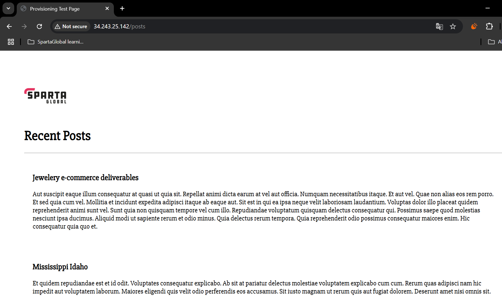

# Udemy Project 7

- [Udemy Project 7](#udemy-project-7)
  - [GitHub repo](#github-repo)
  - [Introduction to the problem](#introduction-to-the-problem)
  - [Diagram showing my automation workflow](#diagram-showing-my-automation-workflow)
- [Detailed steps](#detailed-steps)
  - [Initial VM creation](#initial-vm-creation)
  - [1a. Developing and implementing a Bash script to provision the database VM](#1a-developing-and-implementing-a-bash-script-to-provision-the-database-vm)
    - [What I learnt](#what-i-learnt)
  - [1b. Developing and implementing a Bash script to provision the app VM](#1b-developing-and-implementing-a-bash-script-to-provision-the-app-vm)
    - [What I learnt](#what-i-learnt-1)
  - [2. Creating and testing images to run the app and database](#2-creating-and-testing-images-to-run-the-app-and-database)
    - [What I learnt](#what-i-learnt-2)
  - [(Optional) 3. Following the same steps for Azure using Terraform](#optional-3-following-the-same-steps-for-azure-using-terraform)
    - [What I learnt](#what-i-learnt-3)
  - [Blockers](#blockers)
  - [Benefits I personally saw from the project](#benefits-i-personally-saw-from-the-project)

## GitHub repo

[**Available here**](https://github.com/farahc123/tech501-bench-udemy-pathways/tree/main/Project%207)

## Introduction to the problem

- We have a test app that uses Node JS v20
- This has a front page and a */posts* page that we need to get up and running
- We will be using a 2-tier app such that the app is on one VM/EC2 instance, and MongoDB (our database server) is on the other
- The **goal of this project** is to automate the deployment of this 2-tier app using a **script file** for each VM/EC2 that provisions it with all the required dependencies without needing user input at any stage or manual configuration
  - this needs to be idempotent i.e. work via the **User Data** option when creating the VMs/EC2s, and then it needs to run successfully as a script file again on these VMs/EC2s
- To further automate this setup, I also then want to **create images** of the two VMs/EC2s that have been provisioned by the scripts
  - After this stage, I will use one smaller ***run-app-only.sh* script** on the app VM/EC2 created from this image to get the app running -- again, this needs to be idempotent, so it should work when run as **User Data** when creating an app VM/EC2 from the previous image, as well as successfully run again multiple times on this VM/EC2

## Diagram showing my automation workflow


# Detailed steps

## Initial VM creation

- I used the following settings on AWS:
  - **For DB VM**:
    - **VPC**: default, and default subnet
    - **AMI**: Ubuntu 22.04 LTS (HVM), SSD volume type
  - **Instance type**: t3.micro
  - **Key pair**: my AWS key
  - **Network**: default VPC
  - **Security rules**:
    - allowed SSH (this is done **by default**)
    - **added a new rule** to allow traffic on port 27017 (for mongoDB) from all sources

  - **For app VM**:
    - **VPC**: default, and default subnet
    - **AMI**: Ubuntu 22.04 LTS (HVM), SSD volume type
    - **Instance type**: t3.micro
    - **Key pair**: my AWS key
    - **Network**: default VPC
    - **Security rules**:
    - allowed SSH (this is done **by default**)
      - **added new rules** to allow inbound HTTP access (i.e. port 80) and inbound access on port 3000 (for reverse proxy)
    

## 1a. Developing and implementing a Bash script to provision the database VM

**1.** I created [a script file](prov-db.sh) to provision the database EC2 via the **User Data field** on AWS's GUI that did not need user input
  - To avoid the need for any manual configuration, I used the Bash `sed` command to change MongoDB's BindIP setting to 0.0.0.0:

`sudo sed -i 's/bindIp: 127.0.0.1/bindIp: 0.0.0.0/' /etc/mongod.conf`
   -  I later added some commands to the top of this script file that created a log file that would store a log of when each command was being run:

```
#!/bin/bash

# Define log file
LOG_FILE="/farah_custom_data.log"

# Redirect stdout and stderr to the log file
exec > >(sudo tee -a "$LOG_FILE") 2>&1
```

**2.** After launching the instance, I waited 5 minutes before logging into it (note that, at this stage, I had provided a public IP to the database EC2/VM just so I could log in to troubleshoot, but I later removed it to increase security)

**3.** I then tested that the script had worked with `sudo systemctl status mongod`:
 
**4.** I then tested the idempotency of my script by running it again
   - as the "downgraded" message shows, the script ran the `upgrade` command (which upgraded MongoDB) and then downgraded it to the version specified in my command

   - and this shows that MongoDB was restarted afterwards
  

### What I learnt

- the `sed` command syntax for replacing a string in a given file is:
`sudo sed -i 's/<string to remove>/<string to add in its place>' <file path to do this in>`
  - the `-i` flag tells the `sed` command to write the results of the command to a file, not just to output it to the terminal 

---

## 1b. Developing and implementing a Bash script to provision the app VM

1. I created [a script file](prov-app.sh) that did not need user input and contains the private IP of the above created DB EC2 in the connection string (noting that this would need to change for future iterations of the DB EC2, as the private IP will be different)
  - To avoid the need for any manual configuration, I used the Bash `sed` command again to configure a reverse proxy via Nginx:

`sudo sed -i 's|try_files $uri $uri/ =404;|proxy_pass http://localhost:3000;|' /etc/nginx/sites-available/default`
   -  I later added some commands to the top of this script file that created a log file that would store a log of when each command was being run:

```
#!/bin/bash

# Define log file
LOG_FILE="/farah_custom_data.log"

# Redirect stdout and stderr to the log file
exec > >(sudo tee -a "$LOG_FILE") 2>&1
```

**2.** After launching the instance, I tested that the script had worked by navigating to the public IP of this app EC2:

  - and its */posts* page:


**3.** I then tested the idempotency of my script by running it twice when the app was already running

   - and it started the app again (note the different records, indicating that the `node seeds/seed.js` command had run successfully)


### What I learnt

- in my `sed` command to configure the reverse proxy, I needed to switch to using | as the command delimiter because the / in the string confused it as it is also used as the standard delimiter:
`sudo sed -i 's|try_files $uri $uri/ =404;|proxy_pass http://localhost:3000;|' /etc/nginx/sites-available/default`
- I needed to change ownership of the newly git-cloned repo folder because otherwise it wouldn't let me run `npm install` without `sudo`
  - However I retained the `sudo` in my commands just to be safe
- I needed to add an `npm audit fix` command to my script to remove some errors that I couldn't get past otherwise
- I needed to add a `node seeds/seed.js` command to my script in case my */posts* page hadn't been seeded properly

--- 

## 2. Creating and testing images to run the app and database

**1.** I created images from both of the above provisioned EC2s:
   1.  **DB EC2 image name**: *tech501-farah-udemy-db-from-script*


   2. **App EC2 image name**: *tech501-farah-udemy-app-from-script*

 

**2.** I then used the **Launch instance from AMI** feature to create EC2s from both of these images, using the same settings I initially created (apart from the AMI, as this is now different)
   - I didn't use scripts in the **User data field**, except a *run-app-only.sh* script [found here](run-app-only.sh) used when creating the app EC2 (this overwrites the old connection string and starts the app on this machine when it runs for the first time)

**3.** I then followed this process again, and on this second run, tested that the */posts* page worked and it did 
**4.** I then logged out of this second app EC2, logged back in, created a local version of the *run-app-only.sh* script, ran it, and it worked perfectly (note the new records to indicate the reseeding of the database)


### What I learnt

- That if I added a `node seeds/seed.js` command into my *run-app-only.sh* script (as well as the prov-app.sh script), I could be sure that the script was running successfully because the records on the */posts* page would be different — this helped me ensure the scripts really were running successfully, and not just being stored in my browser's cache
- Only the public IP changes on reboot on AWS (unless we have an elastic IP)
  - i.e. The private IP of an EC2 instance doesn't change after it has been restarted so my *run-app-only.sh* script can be used repeatedly without modifying it so long as I am working with the same DB EC2 (i.e. I haven't created another one)
- I modified my *run-app-only.sh* script so that, before the `pm2 start app.js` line, it ran `pm2 delete app.js` to remove the app from pm2's process list, which seemed to be causing errors when rerunning the script — this is to ensure the script is idempotent

---

## (Optional) 3. Following the same steps for Azure using Terraform 

**1.** After I successfully completed the above parts using AWS and its GUI, I wanted to redo the task on Azure using Terraform to set up the 2-subnet VN and the two VMs
   - The *.tf* files used for this part can be found [here](<Using Terraform>) (with sensitive information hidden in a git-ignored variable file)

**2.** VN created using this method:

**3.** VMs created using this method:
  
   - Successful posts page using this method:
  

**4.** I then created images of both the above VMs e.g.:


**5.** Using Terraform, I then created VMs from both of these images (with an added *run-app-only.sh* script provided as **custom data** for the app VM):
 
**6.** Finally, I tested these VMs from images by accessing the posts page:


### What I learnt

- That in Terraform, Azure uses names, not IDs, for its images
 
---

## Blockers

- When logging into any of the EC2s created from my images, I needed to specify that I wanted to login as the `ubuntu` user like this:
`ssh -i "tech501-farah-aws-key.pem" ubuntu@ec2`...
  - Otherwise I got this error

- I did run into a couple of errors getting the */posts* page to load, which was because I hadn't modified the private IP in the connection string when running the `export` command, so this was easily fixed
- In the early stages of the project, there were a couple of occasions when I was unsure if my User Data scripts were running successfully, so I modified my script files so that before a command was executed, it provided output to a log file — this way I could tell if the script was running successfully or not

## Benefits I personally saw from the project

- The more I automated, the simpler the provisioning and starting of the app got
- Because of this, I preferred using Terraform over the cloud providers' GUIs, as I could easily build and tear down any resources with a few uses of my keyboard rather than following a ClickOps approach 
- I preferred using Azure over AWS in general because, during testing (when I assigned a public IP to the MongoDB VM to enable manual logging in to check), I no longer had to modify the connection string used in the `export` command on the app VM as this was always the same, even on different iterations of my database VM
  - Because of this, in future, if I was creating something with **an IP address I needed to keep the same** (e.g. a VM for a Jenkins server) and I didn't have access to an Elastic IP on AWS, I would prefer to use Azure — because we discovered that AWS's changing IP address caused Jenkins to work very slowly after a reboot of the EC2 it was running on
- 


