# Udemy Project 8

- [Udemy Project 8](#udemy-project-8)
  - [Goal of the project](#goal-of-the-project)
  - [GitHub repo](#github-repo)
  - [Installing Docker Desktop](#installing-docker-desktop)
- [Research](#research)
  - [Virtualisation vs containerisation](#virtualisation-vs-containerisation)
    - [Benefits of virtualisation vs containerisation](#benefits-of-virtualisation-vs-containerisation)
  - [Microservices](#microservices)
    - [Benefits](#benefits)
  - [Docker](#docker)
    - [Dockerfile](#dockerfile)
    - [Docker Compose](#docker-compose)
    - [Alternatives to Docker](#alternatives-to-docker)
    - [Success story using Docker](#success-story-using-docker)
- [Task 1: Learning to manage Docker containers locally](#task-1-learning-to-manage-docker-containers-locally)
  - [Run and pull my first image](#run-and-pull-my-first-image)
  - [Run Nginx web server in a Docker container](#run-nginx-web-server-in-a-docker-container)
  - [Remove a container](#remove-a-container)
  - [Modify the Nginx default page in the running container](#modify-the-nginx-default-page-in-the-running-container)
  - [Run a different container on a different port](#run-a-different-container-on-a-different-port)
  - [**Blockers**](#blockers)
- [Task 2: Using Docker Hub to host custom images](#task-2-using-docker-hub-to-host-custom-images)
  - [Push host-custom-static-webpage container](#push-host-custom-static-webpage-container)
  - [Automate Docker image creation using a Dockerfile](#automate-docker-image-creation-using-a-dockerfile)
  - [**Blockers**](#blockers-1)
- [Task 3: Running Sparta test app in a container using Dockerfile and Docker Compose](#task-3-running-sparta-test-app-in-a-container-using-dockerfile-and-docker-compose)
  - [Initial steps and manual method](#initial-steps-and-manual-method)
  - [Automatic method 1](#automatic-method-1)
  - [Automatic method 2](#automatic-method-2)
  - [**Blockers**](#blockers-2)
- [Extension task: Running the containers on an EC2 instance](#extension-task-running-the-containers-on-an-ec2-instance)
  - [Steps](#steps)
  - [**Blockers**](#blockers-3)
- [What I learnt from the project](#what-i-learnt-from-the-project)
  - [Benefits I personally saw from the project](#benefits-i-personally-saw-from-the-project)

## Goal of the project

- To ultimately containerise the deployment of the Sparta test app and database using Docker and a cloud provider

## GitHub repo

[**Available here**](https://github.com/farahc123/tech501-bench-udemy-pathways/tree/main/Project%208)

## Installing Docker Desktop

- I installed Docker Desktop by following the instructions on [the Docker site](https://docs.docker.com/desktop/setup/install/windows-install)

---

# Research

## Virtualisation vs containerisation

- **Virtualisation**: a technology allowing users to run several isolated VMs on one physical server/host machine
- Downsides:
  - heavier than containerisation because it requires a separate, full OS on each VM
  - uses a lot of resources
  - start-up and provisioning can be slow
- **Containerisation**: bundling (or **encapsulating**) code and all its dependencies into an **image**
- An image is then run in instances called a **container**: a lightweight, standalone, and consistent executable package that includes everything needed to run a piece of software and can be reliably deployed across most systems
- An alternative to full virtualisation, containers use an abstracted OS so that they can run consistently on any machine
- So unlike VMs, containers don't include OSes
- these containers operate in isolated environments, so they run independently from the infrastructure they're deployed into
- **Images**: pre-built packages containing everything needed to run an application, including the code, dependencies, and configuration

### Benefits of virtualisation vs containerisation

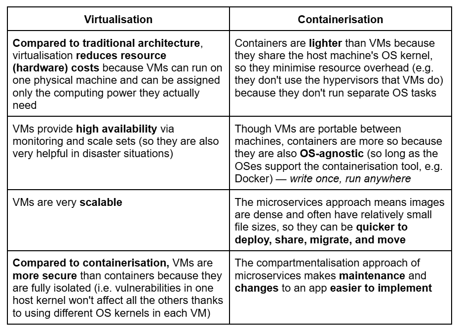

## Microservices

- **Microservices**: splitting large apps into loosely coupled services that run in their own process and can be deployed independently
- Each microservice should be small, as independent as possible, and specialised, with a minimal set of features
- They are a lighter solution to monolith containers, in which the whole app is built into one package and deployed all or nothing
  - Once apps reach a certain size/complexity in monolith architectures, development and start-up slow down
- They communicate using lightweight mechanisms like APIs
- They enable faster feature delivery and scaling for large apps

### Benefits

- They allow DevOps teams to introduce new components without causing downtime because microservices are independent
- Improve fault isolation
- Accelerate deployment
- Optimise resource allocation within organisations because teams work on small, well-defined services

## Docker

- An open-source platform designed to help build, share, and run container apps
- **Official images**: images curated by Docker; typically well-maintained and documented so a good choice for beginners
- [**Docker Hub**](https://hub.docker.com): a cloud-based registry service **serving as a central repository** where Docker users and orgs can find, store, and share their Docker images; like a GitHub for Docker images
-**Docker Engine**: The core technology that runs and manages containers on a machine
- **Tags**: aliases that point to versions of an image (e.g. *latest*, *2.1*, or *Linux*); when you don't specify a tag in your commands, Docker assumes you want the *"latest"* tag
- Benefits of tags:
  -  Useful for **version control** because you can tag images with version numbers (e.g. v1, v2)
  - **Environment separation**: you might tag images for different environments (e.g. dev, staging, prod)
  - **Readability**: custom tags can make it clearer what an image is for
- **Pull command**: On each image's page, there is a "pull command"; this is what you'd use to manually download the image without running a container; e.g. `docker pull hello-world`

- Docker images are built using a **layered filesystem**, with each layer representing a command in the Dockerfile used to build the image
  - this layered approach allows Docker to be efficient with storage and network usage
  - each layer is represented by a long string (called a SHA256 hash)
  - they are cached, speeding up builds of similar images
  - when pushing or pulling images, only changed layers are transferred
- [I also researched Docker commands here](Commands.md)

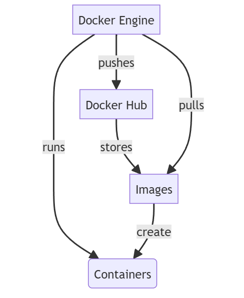

### Dockerfile
  - **Dockerfile**: a text file that contains all the commands a user should call on the CLI to assemble an image; can be helpful to understand how the image was created
  - these are named with a capital D and have no extension
  - each container directory **can only have one** Dockerfile
  - A Dockerfile includes the **base image** to be used, **commands** telling Docker how to set up the image, and the **start up** command
  - must begin with a `FROM` instruction, which specifies the base image to be built from
  - other common instructions include `RUN` e.g. to install dependencies, `COPY` to copy local files into the image, `EXPOSE` which tells Docker that the container listens on given ports, and `CMD` which defines the default command to run on start-up
  - an **ENTRYPOINT** instruction can also reference a script file to specify the commands to be run when the container starts, e.g.
```
FROM nginx
ENV NGINX_PORT 9100
COPY start.sh /start.sh
RUN chmod +x /start.sh
ENTRYPOINT ["/start.sh"]
```
- you must then also create the file referenced in the ENTRYPOINT instruction (i.e. */start.sh* here)

### Docker Compose

- **Docker Compose**: a YAML file that allows you to run multi-container apps and manage each container simultaneously
- allows these linked containers to be spun up or torn down with `docker compose up` and `docker compose down` (there are also optional flags that can be used with these commands; see here)
- standard name is `compose.yml` or `compose.yaml`
- example syntax:
```
services:
  app:
    image: <imagename:optional tag>
    container_name: <optional container name>
    environment:
      - <optional environment variable>
    ports:
      - <ports to be used by service>
    depends_on:
      - <another service defined in the Compose file that is required for this service>
```
- other than `services`, blocks could be `networks`, `volumes`, `configs`, or `secrets`

### Alternatives to Docker

- **Podman**:
  - developed by RedHat
  - daemon-less, so doesn't need root privileges and thus reduces attack surfaces
  - fully open-source (whereas Docker requires licenses for orgs with 150+ employees or $10+ million revenue)
  - but less support for non-Linux OSes
- **Rancher Desktop**:
  - fully open-source 
  - Kubernetes-focused (which can be a pro and a con)
  - has a GUI for Kubernetes, so is more beginner-friendly

### Success story using Docker

- Uber uses Docker for microservices for passenger management, billing, driver management, trip management, and notifications

---

# Task 1: Learning to manage Docker containers locally

## Run and pull my first image
  1. Get help from a Docker command 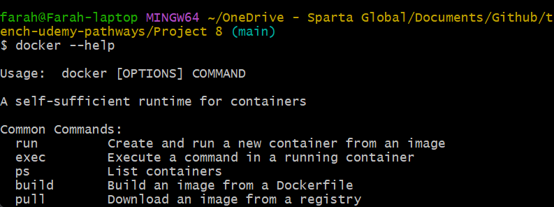
  2. Run a Docker command to show all the images I have on my local machine 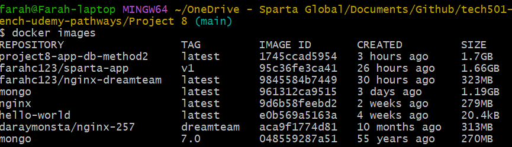
  3.  Run my first Docker container using the `hello-world` image and then re-run the image to see that it doesn't need to be downloaded again 
  
## Run Nginx web server in a Docker container
  1. Download the latest Nginx Docker image using a `docker pull` command, run it so that it exposes the running container on port 80 on my local machine, and run a `docker ps` command to check if it's running 
  2. Check it’s working by going to *localhost* or *127.0.0.1* in a web browser 
  3. Stop the container running 

## Remove a container
  1. Re-start the Nginx container I was previously running and, while the Nginx container is running, try to remove the container with `docker rm` – take note of the error 
  2. Work out the switch/option needed to use to forcibly remove a container while it's running 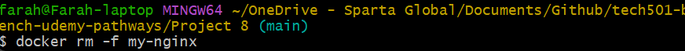
  3. Run the docker command to check whether the container is still there


## Modify the Nginx default page in the running container

  1. Re-run the Nginx container exposed on port 80 of my local machine 
  2.  Check the default webpage of the container in my web browser and keep it open for later 
  3.  Access the shell of the Nginx container that is running with with `docker exec -it my-nginx sh` (use sh not /bin/sh/)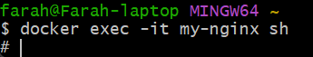
  4. After logging into the shell of the Nginx container, try to do an update & upgrade with `sudo` -- notice the problem, then install sudo to fix it
    -  had to do `apt update` first then install sudo 

  - I could then update and upgrade as normal

  5. Check my present working directory, then navigate to where the default Nginx file is kept

     - Use `nano` to edit index.html – notice the problem, then fix it so I can use `nano` 
     - I had to install `nano` first 
  6. Once nano works, modify the HTML of the file so that instead of “Welcome to nginx!” the home page will be “Welcome to the Tech xxx Dreamteam!” – save my changes
  7. Check how the default web page in the browser has changed 

## Run a different container on a different port
  1. Try to run another container exposed on port 80 on my local machine (connect to port 80 inside the container) – here is the endpoint for the image to use: daraymonsta/nginx-257:dreamteam 
     - occurs because Docker can't bind two containers to the same port as it's already in use by my-nginx container as seen here:
  
  2. Remove the container we tried to run but couldn’t 
  3. Try to run the container from step 2 again but this time expose it on my local machine on port 90. with `docker run -d -p 90:80 daraymonsta/nginx-257:dreamteam`; check this container is running in my web browser at `localhost:90` 


## **Blockers**

1. On the [Nginx modification task](#modify-the-nginx-default-page-in-the-running-container), I ran into this error when running an interactive command to enter the container's shell for the first time because Git Bash has issues with TTY-based commands (i.e. it was trying to use a Windows Git Bash path instead of the correct shell inside the Nginx container) 
   - To solve this, I installed **winpty**, a Windows software package that prevents these errors when running interactive commands
   - By default, I would have had to preface every interactive command with `winpty`, so I created an alias  which I then added to the *.bashrc* file
2. I also had issues trying to use the `/bin/sh/` shell in my `docker exec -it` command, so I switched to `sh` 
3. I had an "Unable to locate package sudo" error because the Nginx Docker image is based on Debian Slim, which doesn't include `sudo` by default 
   - I solved this by running `apt update` and then `apt install sudo`
   - I was then able to `sudo apt update` and `upgrade` as normal

4. I had the same issue with `nano`, which I solved by installing it

---

# Task 2: Using Docker Hub to host custom images 

- To easily access, store, and share images via Docker Hub's central repository

## Push host-custom-static-webpage container
  1. Create an image from the running Nginx container with the modified *index.html* file and push it image to my Docker Hub account 
  2. Use a Docker command to run the container using the above pushed container image, which contains my username on Docker Hub.

## Automate Docker image creation using a Dockerfile

  1. To create a Dockerfile, in the repo (that won't get published), run `nano Dockerfile` (with no extensions)
     - my Dockerfile in tech501-mod-nginx-dockerfile

  2. Create an *index.html* file to use instead of the Nginx default page 
  3. Create a Dockerfile to use the Nginx base image, copy the *index.html* to the location of the Nginx default page in the container, use a `docker build` command to build the custom image, and tag it as *tech501-nginx-auto:v1* 
     - tagging image before pushing 
  4. Push the custom image to Docker Hub  
  5. Use a Docker command to run the container which uses the pushed custom image 
  6. Remove the local copy of the custom image with `docker rmi farahc123/tech501-nginx-auto:v1`

  7. Re-running the container and forcing Docker to pull the custom image from Docker Hub 

## **Blockers**

- I originally didn't tag my image, so I needed to run a `docker tag` before I could push it

---

# Task 3: Running Sparta test app in a container using Dockerfile and Docker Compose

- The goal of this project is to containerise the deployment of the Sparta test app and the database using Docker

## Initial steps and manual method 

1. Created [a folder](<Docker repo>) for this task (because you can only have one Dockerfile per folder) 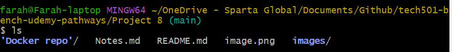
2. I created [a Dockerfile](<Docker repo/Dockerfile>) and [a Docker Compose file](<Docker repo/compose.yml>)
3. The posts hadn't been seeded on *localhost:3000/posts* (this was expected) 
4. To remedy this, I first seeded the posts page manually with `docker exec -it sparta-app-container node seeds/seed.js`

  - This worked: 

## Automatic method 1

- Automatically seeding the database using one command in the Docker Compose file ([all files here](<automatic method 1 docker>)):
  - **Compose file**: 
  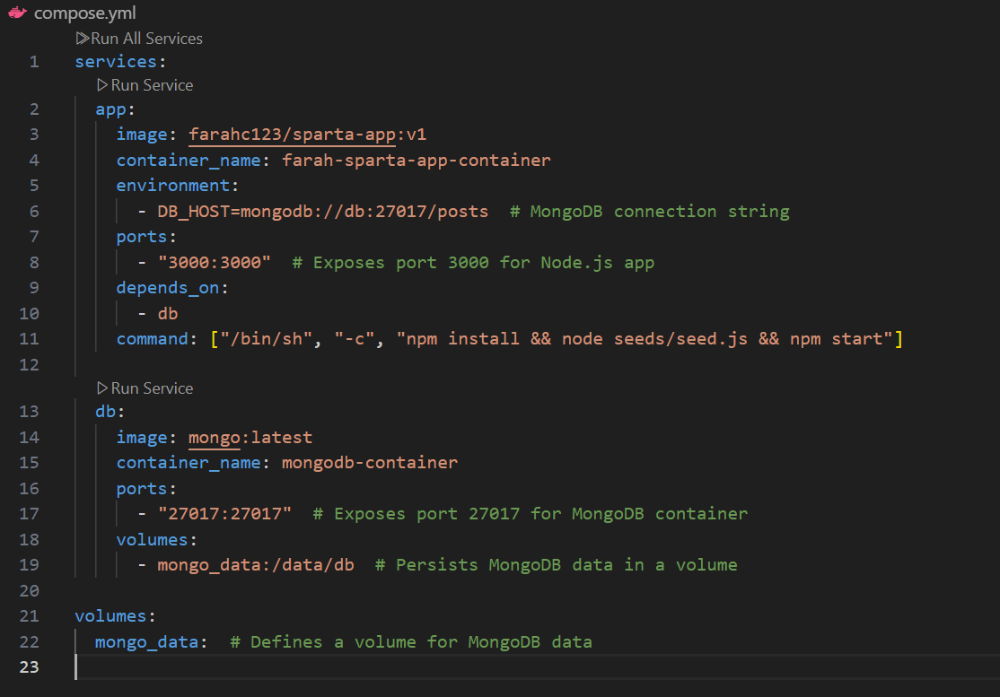

  - **Dockerfile**: 
  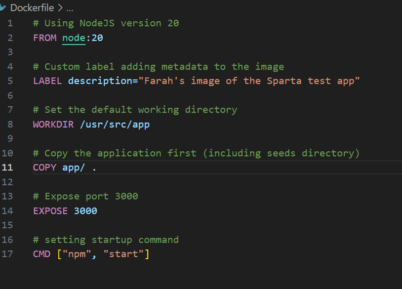
  
  - **Results**:
  

## Automatic method 2
- Automatically seeding the database using a health-check on the MongoDB container in my Docker Compose file ([all files here](<automatic method 2 docker>)):
  - **Compose file:**
  
  - **Dockerfile:**
  
  - **Results** after running `docker compose up -d`:
  
  - I later edited my files to add Nginx in order to configure a reverse proxy:
    - **Dockerfile**: 
    - **Compose file**: 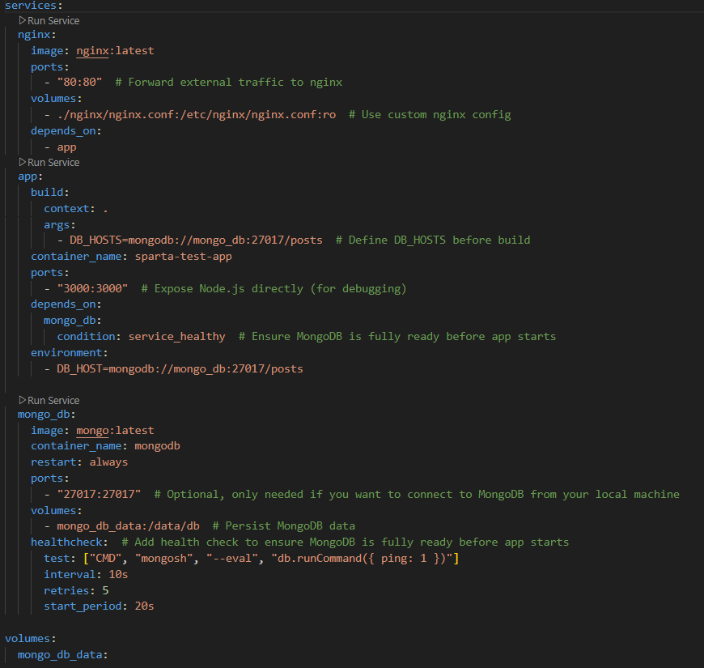
    - **Results** (note the lack of *:3000* in the URL): 

## **Blockers**

- I ran into some issues getting the automatic methods to work, which turned out to be syntax issues, so these were easily fixable

---

# Extension task: Running the containers on an EC2 instance

- The goal of this project is to containerise the deployment of the Sparta test app and the database using Docker and AWS
- This replicates a possible production task (deploying the app onto a VM)  

## Steps

1. After creating an EC2 instance running on Ubuntu 22.04, I had to install Docker on Ubuntu 22.04 via the CLI using [these steps](https://docs.docker.com/engine/install/ubuntu/#install-using-the-repository)
2. I then had to add myself to the Docker group on my EC2 to avoid having to use `sudo` for every `docker` command following [these steps](https://docs.docker.com/engine/install/linux-postinstall/)
3. On my local machine, I created a ***tar*** file with `docker save -o sparta-app-image.tar project8-app-db-method2` -- this saved the Sparta test app image to a file that I could then transfer to my EC2 instance 
4. I then SCPed this tar file to the EC2 instance using `scp -i ~/.ssh/tech501-farah-aws-key.pem sparta-app-image.tar ubuntu@ec2-52-215-19-68.eu-west-1.compute.amazonaws.com:~` 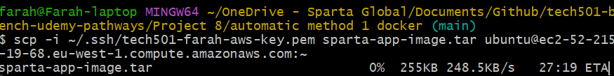
5. Once this tar file was on the EC2 instance, I loaded the image from it with `docker load -i sparta-app-image.tar`
6. I then modified my original Dockerfile to make it work with the tar file (i.e. by removing the `COPY app/ .` command; see below for explanation)
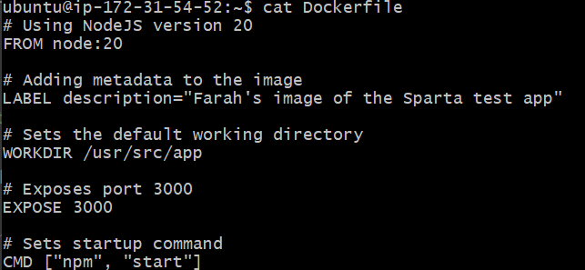
1. I replicated my original Docker Compose file 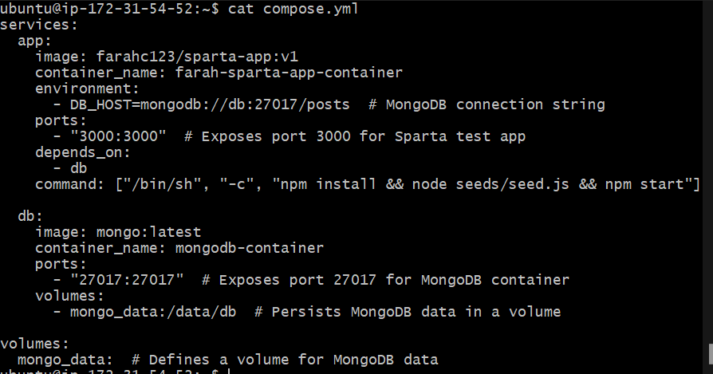
2. I then built the image with `docker build -t sparta-app .`
3.  I started it with `docker compose up -d`
4.  Results: working */posts* page 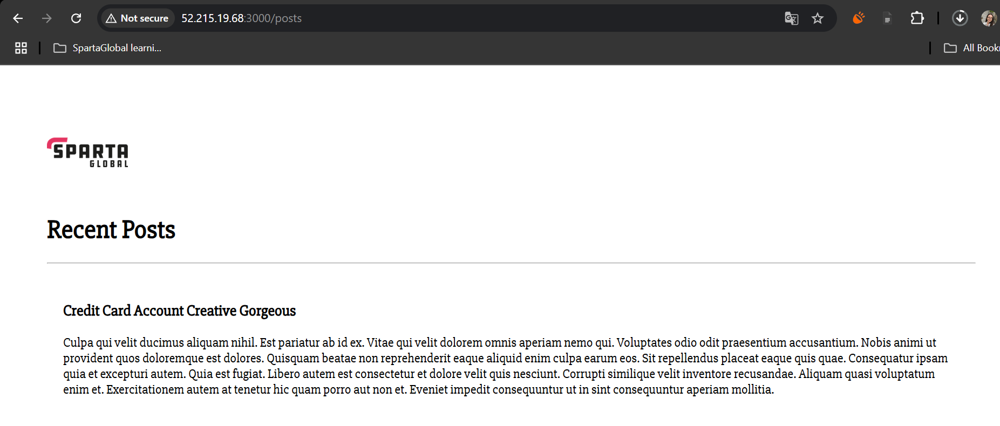

## **Blockers**

- I realised I had to add myself to the Docker group to give myself the correct permissions so that I didn't need to preface every `docker` command with `sudo`
- I also realised I couldn't just reuse my original Dockerfile because I no longer needed to copy the Sparta test app folder (this was referenced in my `COPY app/ .` command) as I already had this in the tar file, so I had to edit my Compose file

# What I learnt from the project

- How Docker containers and images work
- That containers don't always come with the packages I expect (e.g. `sudo` and `nano`)
- The `docker compose up` and `docker compose down` commands work similarly to `terraform apply` and `terraform destroy` in that they build containers (and default networks) from a Docker compose file and then stop and remove everything that the `docker compose up` built 
- About saving images to tar files and how this is helpful when transferring images to a system without internet access, sharing images outside of a registry, or for backing up
- That, on Linux OSes, you have to add yourself to the Docker group in order to avoid having to preface every `docker` command with `sudo`

## Benefits I personally saw from the project

- After the learning curve, using Docker seems like a much easier process than the previous methods for deployment that we used
- On the [Sparta container task](#task-3-running-sparta-test-app-in-a-container-using-dockerfile-and-docker-compose), I preferred my first automatic method command as it was simpler, so I used this as the basis for the EC2 extension task
