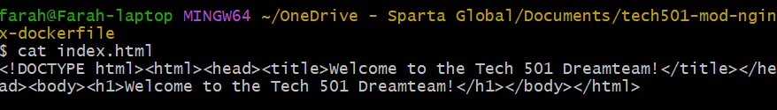

# Udemy Project 8

- [Udemy Project 8](#udemy-project-8)
  - [GitHub repo](#github-repo)
  - [Installing Docker Desktop](#installing-docker-desktop)
  - [Research on microservices, containers, and Docker](#research-on-microservices-containers-and-docker)
  - [Learning to manage Docker containers locally](#learning-to-manage-docker-containers-locally)
    - [Why](#why)
    - [Run and pull my first image](#run-and-pull-my-first-image)
    - [Run NGINX web server in a Docker container](#run-nginx-web-server-in-a-docker-container)
    - [Remove a container](#remove-a-container)
    - [Modify the NGINX default page in the running container](#modify-the-nginx-default-page-in-the-running-container)
    - [Run a different container on a different port](#run-a-different-container-on-a-different-port)
    - [Blockers](#blockers)
    - [What I learnt](#what-i-learnt)
    - [Benefits I personally saw from the project](#benefits-i-personally-saw-from-the-project)
  - [Using Docker Hub to host custom images](#using-docker-hub-to-host-custom-images)
    - [Why](#why-1)
    - [Push host-custom-static-webpage container:](#push-host-custom-static-webpage-container)
    - [Blockers](#blockers-1)
    - [What I learnt](#what-i-learnt-1)
    - [Benefits I personally saw from the project](#benefits-i-personally-saw-from-the-project-1)
  - [Dockerfiles](#dockerfiles)
    - [Automate Docker image creation using a Dockerfile](#automate-docker-image-creation-using-a-dockerfile)
    - [Blockers](#blockers-2)
    - [What I learnt](#what-i-learnt-2)
    - [Benefits I personally saw from the project](#benefits-i-personally-saw-from-the-project-2)
  - [Running Sparta test app in a container and seeding the database with 3 methods](#running-sparta-test-app-in-a-container-and-seeding-the-database-with-3-methods)
    - [Docker Compose research](#docker-compose-research)
    - [Why](#why-2)
    - [Initial steps](#initial-steps)
    - [Automatic method 1](#automatic-method-1)
    - [Automatic method 2](#automatic-method-2)
    - [Blockers](#blockers-3)
    - [What I learnt](#what-i-learnt-3)
    - [Benefits I personally saw from the project](#benefits-i-personally-saw-from-the-project-3)
  - [Extension task: Running the containers on an EC2 instance](#extension-task-running-the-containers-on-an-ec2-instance)
    - [Why](#why-3)
    - [Steps](#steps)
    - [Blockers](#blockers-4)
    - [What I learnt](#what-i-learnt-4)
    - [Benefits I personally saw from the project](#benefits-i-personally-saw-from-the-project-4)

## GitHub repo

[**Available here**](https://github.com/farahc123/tech501-bench-udemy-pathways/tree/main/Project%208)


## Installing Docker Desktop

- I installed Docker Desktop by following the instructions on [the Docker site](https://docs.docker.com/desktop/setup/install/windows-install)

---

## Research on microservices, containers, and Docker

- 


---

## Learning to manage Docker containers locally

- 

### Why

- 

### Run and pull my first image
  1. Get help from the docker command 
  2. Running a Docker command to show all the images I have on my local machine 
  3.  Running my first Docker container using the `hello-world` image and then re-running the image to see that it doesn't need to be downloaded again 
  
### Run NGINX web server in a Docker container
  1. Download the latest nginx Docker image using a `docker pull` command, run it so that it exposes the running container on port 80 on my local machine, and run a `docker ps` command to check if it's running 
  2. Check it’s working by going to *localhost* or *127.0.0.1* in a web browser 
  3. Stop the container running 

### Remove a container
  - Re-start the nginx container I was previously running and, while the nginx container is running, try to remove the container with `docker rm` – take note of the error 
  - Work out the switch/option needed to use to forcibly remove a container while it's running 
  - Run the docker command to check whether the container is still there


### Modify the NGINX default page in the running container


- winpty: Windows software package...
- Git Bash has issues with TTY-based commands.
- `winpty` prevents errors when running interactive commands in Windows.


  1. Re-run the nginx container exposed on port 80 of my local machine 
  2.  Check the default webpage of the container in my web browser and keep it open for later 
  3.  Access the shell of the nginx container that is running with with `docker exec -it my-nginx sh` (use sh not /bin/sh/)
      1.  Because I got an error about “TTY”, I worked out how to run an `alias` command to make sure that every time I ran the `docker` command it would be prefixed with `winpty`   
  4. After logging into the shell of the NGINX container, try to do an update & upgrade with `sudo` -- notice the problem, then install sudo to fix it
    -  had to do `apt update` first then install sudo

     - then updated and upgraded as normal

  1. Check my present working directory, then navigate to where the default NGINX file is kept
    - Use `nano` to edit index.html – notice the problem, then fix it so I can use `nano` 
    - I had to install `nano` first 
  2. Once nano works, modify the HTML of the file so that instead of “Welcome to nginx!” the home page will be “Welcome to the Tech xxx Dreamteam!” – save my changes
  3. Check how the default web page in the browser has changed 

### Run a different container on a different port
  1. Try to run another container exposed on port 80 on my local machine (connect to port 80 inside the container) – here is the endpoint for the image to use: daraymonsta/nginx-257:dreamteam 
     - occurs because Docker can't bind two containers to the same port as it's already in use by my-nginx container as seen here:
  
  2. Remove the container we tried to run but couldn’t 
  3. Try to run the container from step 2 again but this time expose it on my local machine on port 90. with `docker run -d -p 90:80 daraymonsta/nginx-257:dreamteam`; check this container is running in my web browser at `localhost:90` 


### Blockers

- 

### What I learnt

- 

### Benefits I personally saw from the project

- 

---

## Using Docker Hub to host custom images

- 

### Why

- 

### Push host-custom-static-webpage container:
  1. Create an image from the running NGINX container with the modified *index.html* file and push it image to my Docker Hub account 
  2. Use a Docker command to run the container using the above pushed container image, which contains my username on Docker Hub.

### Blockers

- 

### What I learnt

- 

### Benefits I personally saw from the project

- 

---

## Dockerfiles
  - **Dockerfile**: a text document that contains all the commands a user should call on the CLI to assemble an image
  - includes the **base image** to be used, **commands** telling Docker how to set up the image, and the **startup** command
  - must begin with a `FROM` instruction, which specifies the base image to be built from
  - other common instructions include `RUN` e.g. to install dependencies, `COPY` to copy local files into the image, `EXPOSE` which tells Docker that the container listens on given ports, and `CMD` which defines the default command to run on startup
  - an **ENTRYPOINT** instruction can also reference a script to specify the commands to be run when the container starts
  - e.g. in a Dockerfile:
```
FROM nginx
ENV NGINX_PORT 9100
COPY start.sh /start.sh
RUN chmod +x /start.sh
ENTRYPOINT ["/start.sh"]
```
- you must then also create the file referenced in the ENTRYPOINT instruction (i.e. */start.sh* here)

### Automate Docker image creation using a Dockerfile

  1. To create a Dockerfile, in the repo (that won't get published), run `nano Dockerfile` (with no extensions)
     - my Dockerfile in tech501-mod-nginx-dockerfile

  2. Create an *index.html* file to use instead of the NGINX default page 
  3. Create a Dockerfile to use the NGINX base image, copy the *index.html* to the location of the NGINX default page in the container, use a `docker build` command to build the custom image, and tag it as *tech501-nginx-auto:v1* 
     - tagging image before pushing 
  4. Push the custom image to Docker Hub  
  5. Use a Docker command to run the container which uses the pushed custom image 
  6. Remove the local copy of the custom image with `docker rmi farahc123/tech501-nginx-auto:v1`

  7. Re-running the container and forcing Docker to pull the custom image from Docker Hub 

### Blockers

- 

### What I learnt

- 

### Benefits I personally saw from the project

- 

---

## Running Sparta test app in a container and seeding the database with 3 methods

- Using Dockerfile and Docker Compose

### Docker Compose research

- research

### Why

- To 

### Initial steps

1. Created a folder for this task (because you can only have one Dockerfile per folder) 
2. I created [a Dockerfile](<Docker repo/Dockerfile>) and [a Docker Compose file](<Docker repo/compose.yml>) for this task
3. The posts hadn't been seeded on *localhost:3000/posts* (this was expected) 
4. To remedy this, I first seeded the posts page manually with `docker exec -it sparta-app-container node seeds/seed.js`

  - This worked: 

### Automatic method 1

- Automatically seeding the database using one command in the Docker Compose file:
  - Compose file: 
  - Dockerfile: 
  - Results: 

### Automatic method 2
- Automatically seeding the database using a healthcheck on the MongoDB container in my Docker Compose file ([all files here](<automatic method 2 docker>)):
  
  - Dockerfile:
  
  - Results after `docker compose up -d`:
  
  - I later edited my files to add NGINX in order to configure a reverse proxy:
    - Dockerfile: 
    - Compose file: 
    - Results (note the lack of *:3000* in the URL): 


### Blockers

- 

### What I learnt

- The `docker compose up` and `docker compose down` commands work similarly to `terraform apply` and `terraform destroy` in that they build containers (and default networks) from a Docker compose file and then stop and remove everything that the `docker compose up` built 

### Benefits I personally saw from the project

- I preferred my second automatic method command as it was simpler, so I used this as the basis for the EC2 extension task

---

## Extension task: Running the containers on an EC2 instance

### Why

- To replicate a possible production task (deploying the app onto a VM)  

### Steps

1. After creating an EC2 instance running on Ubuntu 22.04, I had to install Docker on Ubuntu 22.04 via the CLI using [these steps](https://docs.docker.com/engine/install/ubuntu/#install-using-the-repository)
2. I then had to add myself to the Docker group on my EC2 to avoid having to use `sudo` for every `docker` command following [these steps](https://docs.docker.com/engine/install/linux-postinstall/)
3. On my local machine, I created a ***tar*** file with `docker save -o sparta-app-image.tar project8-app-db-method2` -- this saved the Sparta test app image to a file that I could then transfer to my EC2 instance 
4. I then SCPed this tar file to the EC2 instance using `scp -i ~/.ssh/tech501-farah-aws-key.pem sparta-app-image.tar ubuntu@ec2-52-215-19-68.eu-west-1.compute.amazonaws.com:~` 
5. Once this tar file was on the EC2 instance, I loaded the image from it with `docker load -i sparta-app-image.tar`
6. I then modified my original Dockerfile to make it work with the tar file (i.e. by removing the `COPY app/ .` command; see below for explanation)

1. I replicated my original Docker Compose file 
2. I then built the image with `docker build -t sparta-app .`
3.  I started it with `docker compose up -d`
4.  Results: working */posts* page 

### Blockers

- I realised I had to add myself to the Docker group to give myself the correct permissions so that I didn't need to preface every `docker` command with `sudo`
- I also realised I couldn't just reuse my original Dockerfile because I no longer needed to copy the Sparta test app folder (this was referenced in my `COPY app/ .` command) as I already had this in the tar file, so I had to edit my Compose file

### What I learnt

- I learnt about saving images to tar files and how this is helpful when trasferring images to a system without internet access, sharing images outside of a registry, or for backing up
- I learnt that, on Linux OSes, you have to add yourself to the Docker group in order to avoid having to preface every `docker` command with `sudo`

### Benefits I personally saw from the project

- After the Docker learning curve, this seems like a much easier process than the previous methods for deployment that we used
- It's also reusable