# Project 9: Ansible

- [Project 9: Ansible](#project-9-ansible)
  - [Goal of this project](#goal-of-this-project)
  - [EC2 names](#ec2-names)
  - [Initial steps](#initial-steps)
- [Research](#research)
  - [Ansible](#ansible)
  - [Ansible ad hoc commands](#ansible-ad-hoc-commands)
  - [Diagram of my Ansible architecture](#diagram-of-my-ansible-architecture)
  - [Task 1](#task-1)
  - [Task 2](#task-2)
  - [Task 3](#task-3)
  - [Task 4](#task-4)
  - [Task 5](#task-5)
    - [Blockers](#blockers)
  - [Task 6](#task-6)
  - [Extension task on gathering facts](#extension-task-on-gathering-facts)
  - [Database VM task](#database-vm-task)
  - [Update upgrade playbook task](#update-upgrade-playbook-task)
- [blockers?](#blockers-1)
- [What I learnt](#what-i-learnt)
- [Benefits I personally saw from the project](#benefits-i-personally-saw-from-the-project)

## Goal of this project

The goal of this project is to use Ansible to implement a 2-tier cloud deployment of the Sparta test app (which uses Node JS v20) and database.

## EC2 names

- For this task, I created 3 EC2s:
  - *tech501-farah-ubuntu-2204-ansible-controller*
  - *tech501-farah-ubuntu-2204-ansible-node-db*
  - *tech501-farah-ubuntu-2204-ansible-target-node-app*

## Initial steps

1. I first had to download WSL (windows subsystem for Linux) as Ansible can't be... with `wsl --install` in Powershell
2. I then created the Ubuntu account `farah`   
   - to log in to wsl on powershell as me, run `wsl -u farah`
2. on git bash, I used `/c/Windows/System32/wsl.exe -u farah` to start a WSL session as me
3. I then ran
```
sudo apt update
sudo apt install ansible -y
# confirming ansible installed
ansible --version
```

# Research

## Ansible

## Ansible ad hoc commands
- used on tasks you rarely repeat
- Why is using the ‘ping’ module an ad hoc command?
- examples:
  - 
- the default module is the `command` module
- advantages and disadvantages of `command` module:
  - 

## Diagram of my Ansible architecture

## Task 1

1. Created my controller EC2 and target node EC2 and confirmed I could SSH into them 
2. Set up dependencies on the controller:
   1. `sudo apt update`
   2. `sudo add-apt-repository --yes --update ppa:ansible/ansible`
   3. `sudo apt install ansible -y`
3. I had to create my */etc/ansible* folder and the files within it as this wasn't done automatically in the install 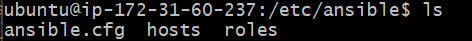
4. Copied my *tech501-farah-aws-key.pem* (i.e. private SSH key) to my controller EC2 and set permissions to read-only for Owner 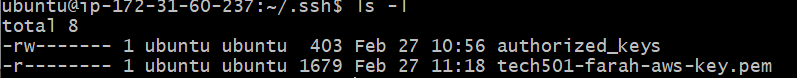
5. I then SSHed into the target node from the controller with `ssh -i "tech501-farah-aws-key.pem" ubuntu@ec2-34-245-195-254.eu-west-1.compute.amazonaws.com` 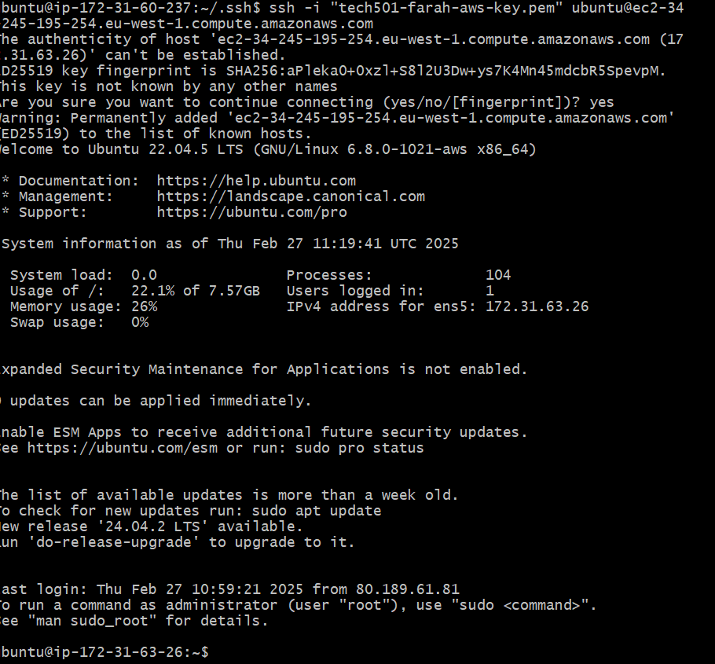 
6. Tried to ping with `ansible all -m ping` and got the expected error as the *hosts* file is currently empty 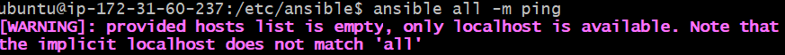
7. Edited the *hosts* file to add the public IP of the target node EC2 instance 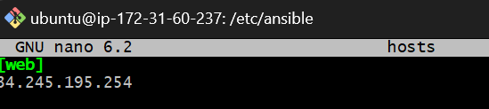
8. Ran the `ping` command again and got this expected new error 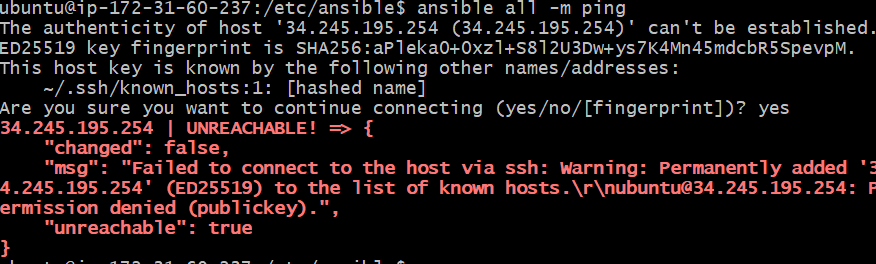
9. Edited the *hosts* file to add the username to be logged into and the location of the private key file 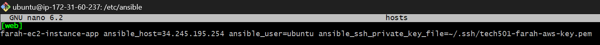
10. Ran the `ping` command again, this time successfully 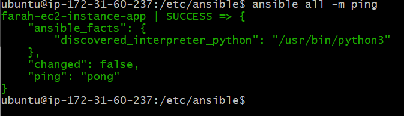
11. Successfully ran the `ping` command only on the *web* group of hosts with `ansible web -m ping` 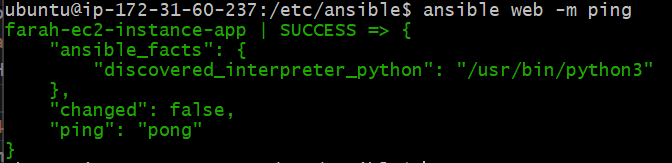

## Task 2
- Ran an `ansible` command to get details on the Linux version used in my web group with `ansible web -a "lsb_release -a"` 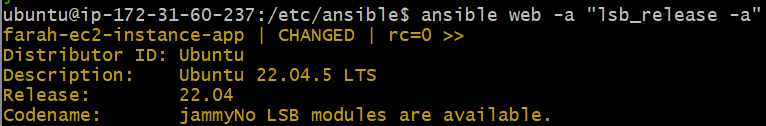
- Ran an `ansible` command to get the date on the Linux version used in my web group with ` ansible web -a "date"` 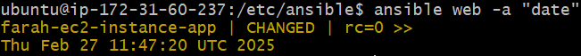

## Task 3

1. **Command module method**:
  1. Updating my target node (named *farah-ec2-instance-app*) with `ansible farah-ec2-instance-app -b -a "apt update"` 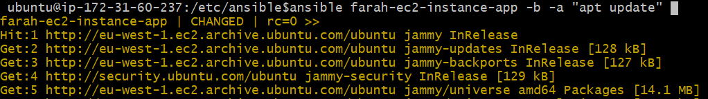
   - note the use of `-b` to become a super-user and avoid having to use `sudo` in my commands
  2. Upgrading my target node with `ansible farah-ec2-instance-app -b -a "apt upgrade -y"` 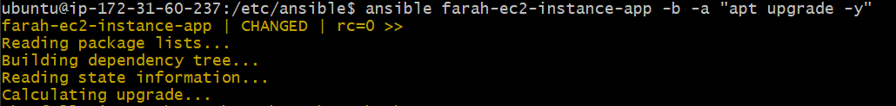
**- Downsides of this method:**
  - designed to run one command at a time, so doesn't support chaining (which is why I had to run the commands separately) or piping because it doesn't invoke the shell
**2. Shell module method:**
   1. Updating and upgrading the target node with `ansible farah-ec2-instance-app -b -m shell -a "apt update && apt upgrade -y"` 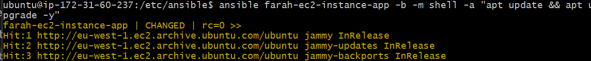
   - note the use of `-m shell` to specify the `shell` module, i.e. so we don't use the default `command` module
   - note that the `shell` module can handle command chaining
- Downsides of this method:
  - it's not idempotent **(need more on this)**
**3. APT module method:**
   1. Updating and upgrading the target node with `ansible farah-ec2-instance-app -m apt -a "update_cache=yes upgrade=dist" -b"` 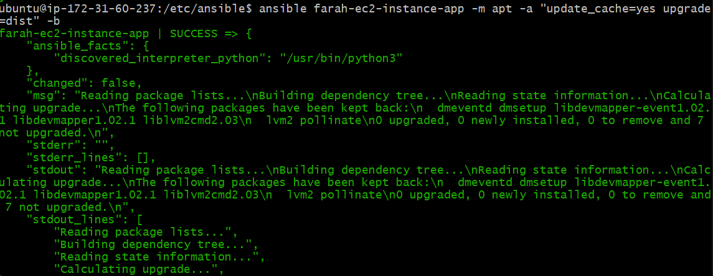

## Task 4
 - Using an ad-hoc command (via the `copy` module) to copy my private SSH key from my controller node to the target node with `ansible farah-ec2-instance-app -m copy -a "src=~/.ssh/tech501-farah-aws-key.pem dest=/home/ubuntu/.ssh/tech501-farah-aws-key.pem mode=0400 owner=ubuntu group=ubuntu"` 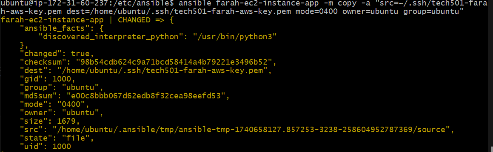! [result](image-17.png)

## Task 5
1. Created an Ansible playbook to install NGINX named *install_nginx.yml* (see here)
   1. Before running the playbook, I checked its syntax with `ansible-playbook install_nginx.yml  --syntax-check` and it was fine 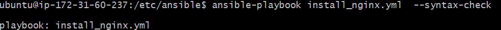
2. Successfully ran the playbook with `ansible-playbook install_nginx.yml` 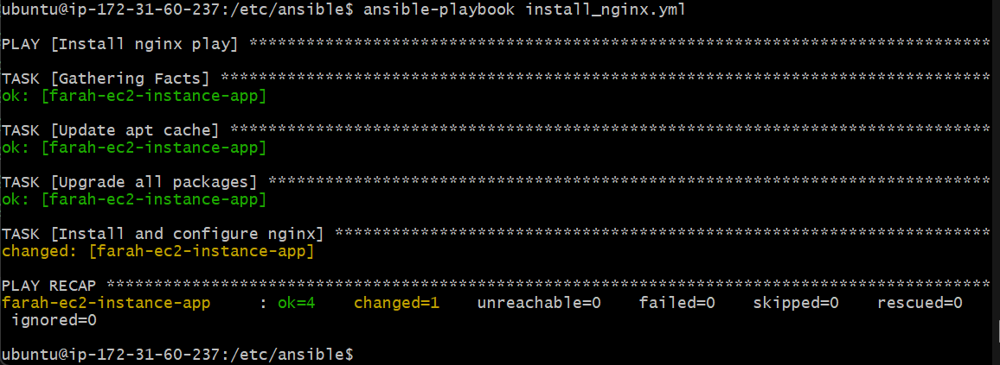
3. Git cloned the app folder to my controller EC2 with `git clone https://github.com/farahc123/tech501-sparta-app.git`
4. Created a playbook to provision some dependencies and launch the app in the foreground named *prov_app_with_npm_start.yml*
   1. checked its syntax with `ansible-playbook prov_app_with_npm_start.yml  --syntax-check` 
   2. Successfully ran it: 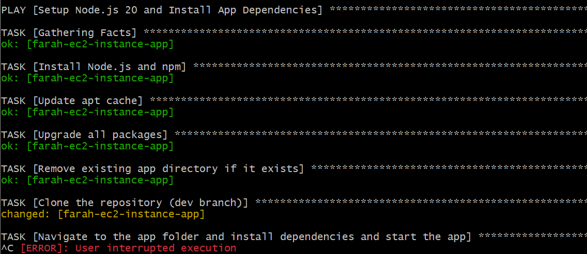
   3. Results: 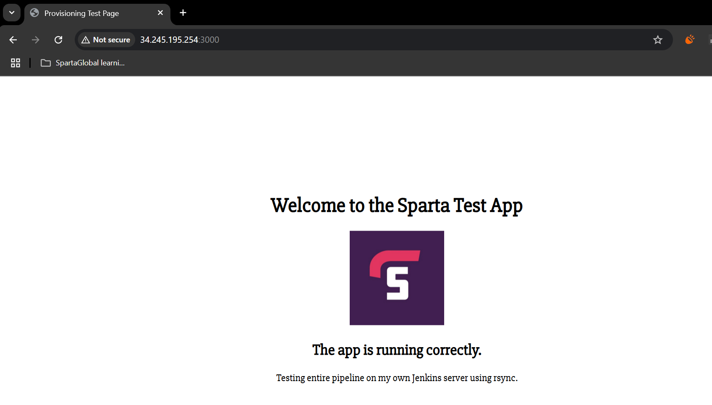
   - Note that this command will always hang when running the playbook as `npm` is running in the foreground 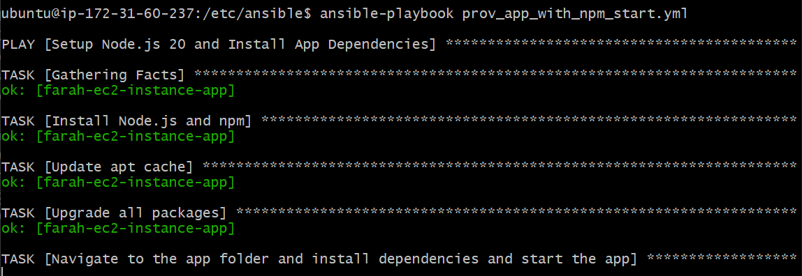

### Blockers

- I kept getting an error because the versions of Nodejs and NPM that were being installed were incompatible, so I added tasks into this playbook to ensure that all packages were updated and upgraded after Nodejs and NPM were installed
- this resolved the issue


## Task 6

1. I duplicated the above script and then modified it so it installed PM2 globally and then ran the app via PM2 (link here) 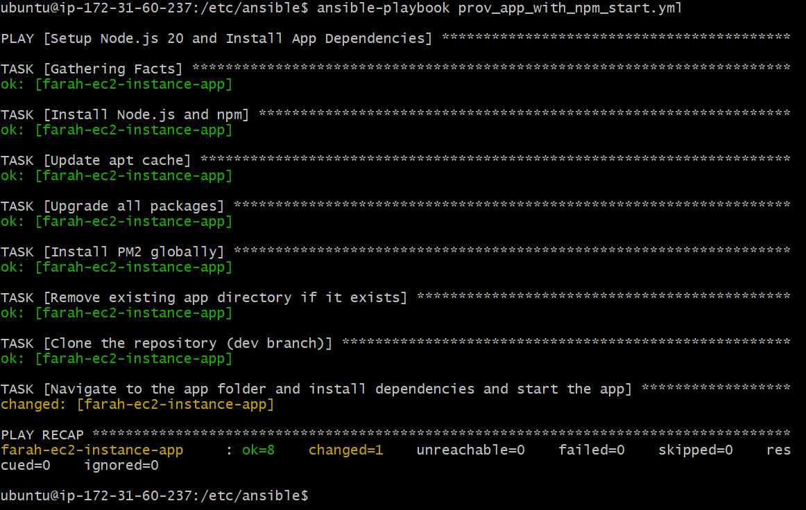
2. Results: 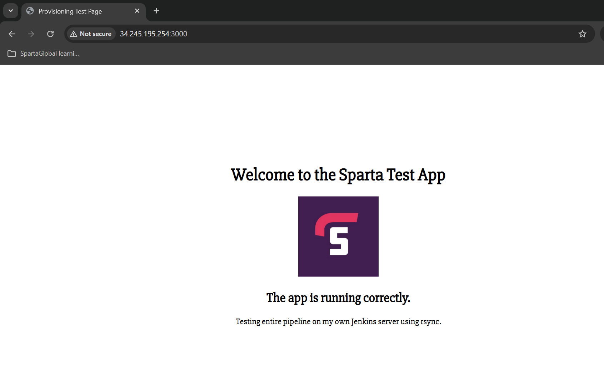
3. I verified this by running `sudo su` and `pm2 list` on the target node 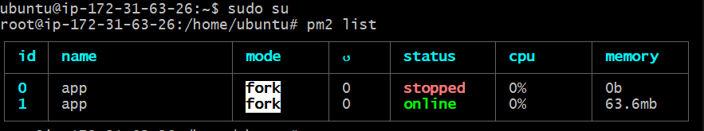

**NOTE THAT I WILL NEED TO CHANGE THE IP ADDRESS IN MY HOSTS FILE ON THE CONTROLLER EC2 EVERY TIME THE TARGET NODE IS REBOOTED**

## Extension task on gathering facts

- 

## Database VM task

1. Created DB VM with ports 22 and 27017 open to all sources
2. Ensured I could SSH into it from the target controller with `ssh -i "tech501-farah-aws-key.pem" ubuntu@ec2-3-252-100-157.eu-west-1.compute.amazonaws.com` 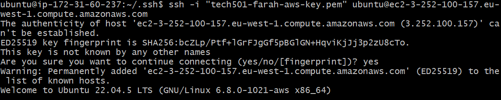
3. Pinged this to manually accept the first connection with `ansible db -m ping` 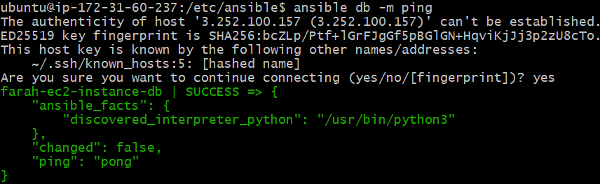
4. Pinged all hosts `ansible all -m ping` 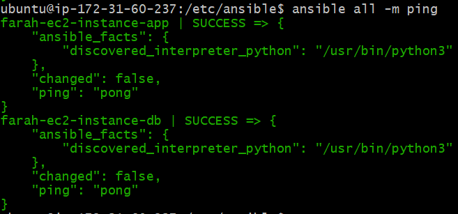

## Update upgrade playbook task

- Research: Why it usually best to keep a separate update & upgrade from your playbooks which do route application deployment
1. Created an update upgrade playbook (link)
    - before running, checked its syntax with `ansible-playbook update_upgrade_all.yml --syntax-check`
2. Successful results, showing it had updates and upgrades to do on the newly created DB EC2 (as expected) 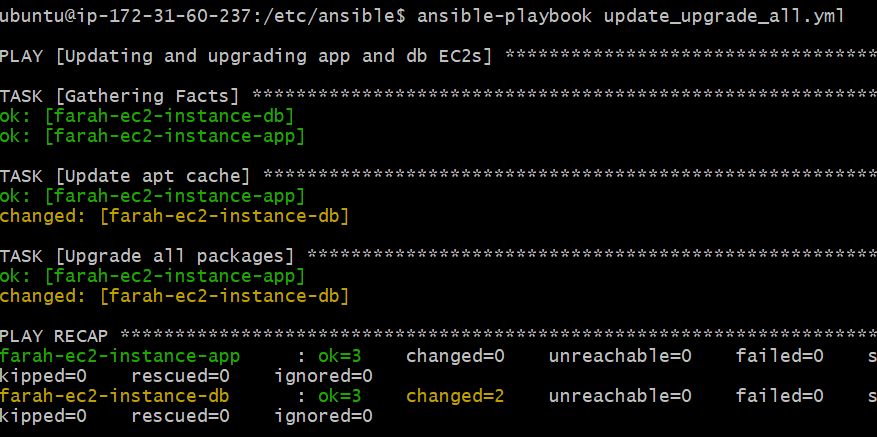
3. ad hoc command from controller to check mongodb is running on db hosts `ansible db -m systemd -a "name=mongod state=started"` 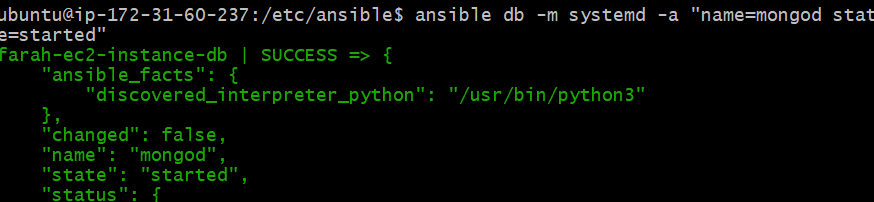
4. ad hoc command from controller to check bindip on db hosts `ansible db -m command -a "grep 'bindIp' /etc/mongod.conf"` 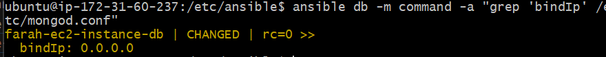
5. tested connection with `pm2 kill` `export DB_HOST=mongodb://172.31.49.226:27017/posts` and `pm2 start app.js`
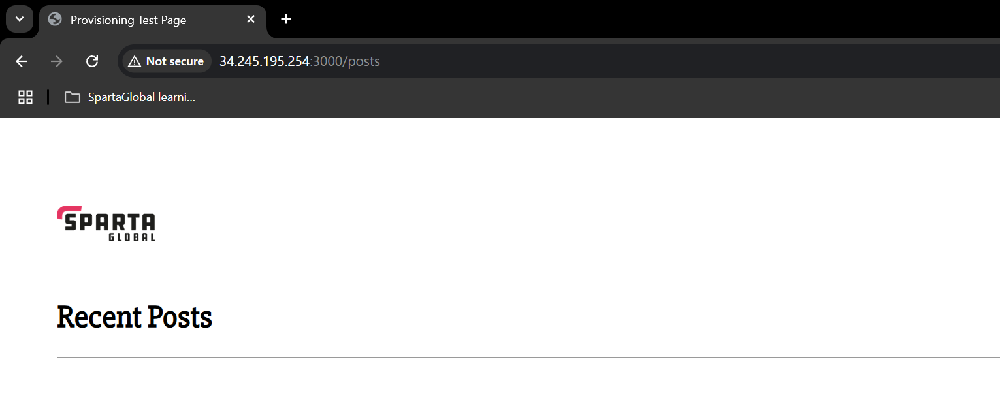


- I've added reverse proxy to my prov_app_with_pm2 playbook (note URL) 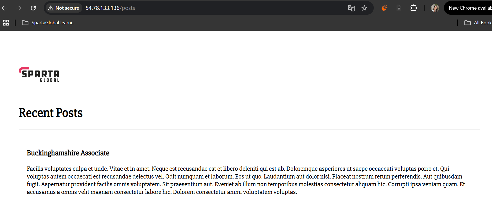
- I added a task to do this 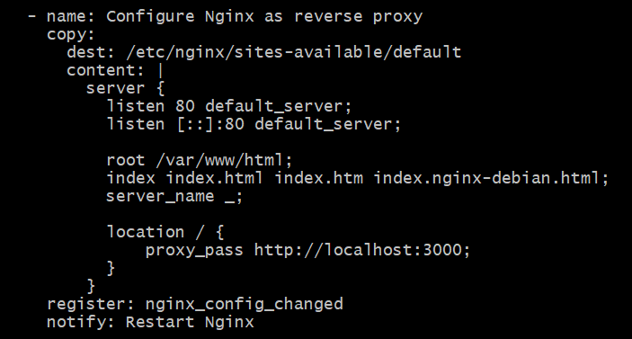
  - and linked it to a handler to restart nginx after the reverse proxy was set 

# blockers?

- i was getting these notifications so i edited my *install_mongodb* playbook to remove all instances of `sudo` in any shell modules and to use the recommended modules named 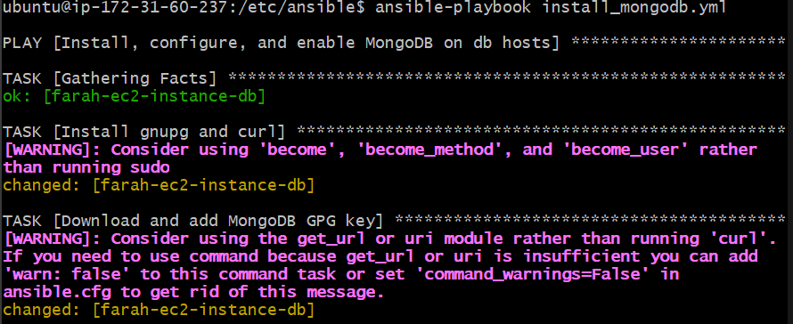

# What I learnt

# Benefits I personally saw from the project