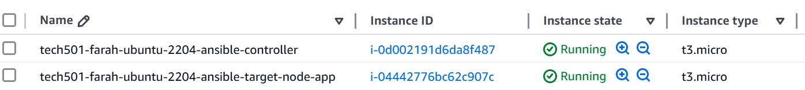

# **Project 9: Ansible**

- [**Project 9: Ansible**](#project-9-ansible)
  - [Goal of this project](#goal-of-this-project)
- [**Research**](#research)
  - [Infrastructure as Code (IaC)](#infrastructure-as-code-iac)
    - [Benefits of IaC](#benefits-of-iac)
  - [Ansible](#ansible)
  - [Ansible ad hoc commands](#ansible-ad-hoc-commands)
  - [Diagram of my Ansible architecture](#diagram-of-my-ansible-architecture)
- [**Day 1 tasks**](#day-1-tasks)
  - [Create EC2 instances for Ansible controller and first target node](#create-ec2-instances-for-ansible-controller-and-first-target-node)
  - [Set up dependencies on the controller](#set-up-dependencies-on-the-controller)
  - [Use other ad hoc commands](#use-other-ad-hoc-commands)
  - [Do update and upgrade on target nodes using ad hoc commands](#do-update-and-upgrade-on-target-nodes-using-ad-hoc-commands)
    - [Command module method](#command-module-method)
    - [Shell module method](#shell-module-method)
    - [APT module method](#apt-module-method)
  - [Consolidate ad hoc commands by copying a file to a target node](#consolidate-ad-hoc-commands-by-copying-a-file-to-a-target-node)
  - [Create and run playbook to install nginx on target node](#create-and-run-playbook-to-install-nginx-on-target-node)
  - [Create and run playbook to provision app VM](#create-and-run-playbook-to-provision-app-vm)
  - [Create and run playbook to run app with PM2](#create-and-run-playbook-to-run-app-with-pm2)
  - [**Blockers**](#blockers)
- [**Day 2 tasks**](#day-2-tasks)
  - [Create the database VM (another Ansible target node)](#create-the-database-vm-another-ansible-target-node)
  - [Create and run playbook to update and upgrade web and db groups of machines](#create-and-run-playbook-to-update-and-upgrade-web-and-db-groups-of-machines)
  - [Create and run playbook to install Mongo DB](#create-and-run-playbook-to-install-mongo-db)
  - [Create and run playbooks to provision the app and database](#create-and-run-playbooks-to-provision-the-app-and-database)
  - [Extension task: Create and run playbook to print facts gathered](#extension-task-create-and-run-playbook-to-print-facts-gathered)
  - [**Blockers**](#blockers-1)
- [What I learnt](#what-i-learnt)
- [Benefits I personally saw from the project](#benefits-i-personally-saw-from-the-project)

## Goal of this project

The goal of this project is to use Ansible and AWS to implement a 2-tier cloud deployment of the Sparta test app (which uses Node JS v20) and database.

# **Research**

## Infrastructure as Code (IaC)

- **IaC**: creating or configuring infrastructure via code, not GUIs
- **declarative IaC**: users define the desired end state/result, and the tool handles how to get there (e.g. Terraform)
- **imperative IaC**: users specify the exact steps taken (e.g. Ansible) 
- **provisioning infrastructure**: creating and setting up IT infrastructure
- **idempotent**: when it doesn't matter how many times you run a script, the tool will make sure that the desired state will always be reached (e.g. running a script twice won't result in 2 results/different results)
- **configuration drift**:
  - when you have an ecosystem like multiple servers running under a load balancer, and all of the servers should be configured the same
  - if someone logs into one and modifies the setting on one, this results in configuration drift between the servers
  - this becomes an issue when, e.g., you have to migrate them all to the cloud and you have to work out which server has the ideal configuration
- two types of IaC tools:
  - **configuration management** tools: maintain and update config of IT infrastructure, e.g. Ansible
  - **orchestration tools**: manage lifecycle of infrastructure resources, e.g. Terraform
- you should use IaC when you need consistent environments e.g. whenever you need to provision VMs at scale
- **IaC tools:**
  - Terraform
  - Ansible
  - Azure Resource ManaGer
  - AWS CloudFormation

### Benefits of IaC
- scalable
- quicker than manually creating/configuring resources
- repeatable (via idempotency)
- eliminate human error; IaC tools like Ansible can prevent configuration drift by specifying the exact configuration you want

## Ansible

- **Ansible**: an open-source automation tool that allows you to configure IT infrastructure
- Ansible is installed on a **controller node**, which can then manage the configuration of remote **target nodes **
- Ansible is **agentless**, i.e. doesn't require you to install anything on the target nodes
- Ansible is written in Python
- **playbook**: a file that defines a set of Ansible tasks to be executed on remote hosts; written in YAML because it's easy to read and write ([example here](<Playbooks/example playbook with different modules.yml>))
- it uses **modules**
- Installing Ansible should create the */etc/ansible/* directory, but it's normal for this not to be created in some environments, so it (and all the files within) can be manually created if not automatically done
-  **Typical files in */etc/ansible***:
   - [***ansible.cfg***](<Playbooks/example ansible.cfg file>) — configuration file, usually named this if using only one config file but doesn't strictly have to be
   - [***hosts***](<Playbooks/example hosts file>) (i.e. inventory file) — file containing the host groups and hosts, usually named this if only using one hosts file but doesn't strictly have to be
- **Hosts/inventory file:**
  - usually *.ini* or *.yml* but I didn't specify an extension and it worked
  - you can have multiple hosts/inventory files (useful for different environments), and you can run a playbook on multiple hosts file by chaining this `-i <path to first hosts file> -i <path to second hosts file>` etc. after the `ansible-playbook` command
    - note that the playbook will only run once on any hosts common to both files as Ansible **de-duplicates** hosts by default
    - note that any `debug` (i.e. print outs of variables) in a single-playbook, multi-hosts file execution will only print the value for the last hosts file in the `ansible-playbook` statement (e.g. the last hostname in the order)
  - can include nested groups, i.e. hierarchies, e.g. `[production: children] webservers`, which tells Ansible that production is a group with children groups (here, *webservers*)
    - this means that any hosts in *webservers* are also in *production*, so configs applied to/commands run on the *production* group are also applied to all hosts in all of its child groups (note that you can still run commands and apply configs only on the child groups by specifying them)
- **Gathering facts** in Ansible means collecting information about a host's system outputted as variables; these include information on their OS, RAM, storage, IP address, etc.
  - this is helpful when you need to check information about a host's system
  - gathering facts means you can run commands based on the value of these facts because they're stored as variables, e.g. running certain tasks on hosts when `ansible_os_family == "Ubuntu"`
  - you **wouldn't** gather facts if you didn't need to, as it  makes the playbook take longer to run
- Why it's usually best to keep a separate playbook to run `update` & `upgrade` from the playbooks that deploy apps deployment:
  - it reduces the time taken to run the app deployment playbooks
  - updating and upgrading may change the versions of dependencies, which could break the app

- **Organisations that use Ansible**:
  - NASA
  - Qantas
  - US Bank
  - Hootsuite

## Ansible ad hoc commands

- used on quick one-off tasks, i.e. tasks that you rarely repeat
- good for simple operations like checking system statuses, managing files, troubleshooting, or otherwise executing single commands across multiple servers
- general syntax is `ansible [hosts/group] -m [module to be used] -a "[module arguments]"`
- example commands ([see here for more detail](Commands.md/#ad-hoc-commands)):
  - `ping` module — for testing connections between controller and target nodes
  - `command` module (default module used for ad hoc commands, so doesn't need to be specified with `-m command`)
  - `copy` module — for copying folders and files from the local machine to remote hosts
  - `file` module — manages files and directories on hosts
  - `debug` module — prints statements during the play's execution; often prints the value of variables to verify changes have been made
  - `setup` module — gathers facts (i.e. information) outputted as variables about target host(s), e.g. OS, RAM, storage, IP address, etc.

- **Advantages of default `command` module:**
  - quick and simple way of executing single shell commands at a time on a remote host
- **Disadvantages of default `command` module:**
  - doesn't support shell variables, command chaining, or operations like `|`, `>`, `<` (so you need to use `shell` module instead for these) 

## Diagram of my Ansible architecture

# **Day 1 tasks**

## Create EC2 instances for Ansible controller and first target node

1. Created my controller EC2 and first target node (i.e. the app EC2) and confirmed I could SSH into them 
  - **Controller EC2 settings**:
    - **Image**: Ubuntu 22.04 LTS
    - **Size**: t3.micro
    - **Security rules**: allow SSH
    - **Key pair**: my AWS key
  - **App EC2 settings**:
    - same as above, except I allowed **SSH, HTTP, and port 3000**

## Set up dependencies on the controller

1. SSHed into the machine and installed Ansible with:
   1. `sudo apt update && sudo apt upgrade`
   2. `sudo add-apt-repository --yes --update ppa:ansible/ansible`
   3. `sudo apt install ansible -y`
   4. `sudo apt update && sudo apt upgrade` — I didn't do this initially, but it would have helped avoid the blocker I had given the Ansible version that was installed by default was 2.10.8 for some reason, which caused issues later on ([see here](#blockers))
2. I had to manually create my */etc/ansible* folder and the files within it as this wasn't done automatically in the install 
3. Copied and pasted my *tech501-farah-aws-key.pem* (i.e. private SSH key) to the SSH folder on my controller EC2 and set permissions to read-only for Owner with `sudo chmod 400 <key name>` 
4. I then SSHed into the target node from the controller with `ssh -i "tech501-farah-aws-key.pem" ubuntu@ec2-34-245-195-254.eu-west-1.compute.amazonaws.com`  
5. In a new terminal window, I SSHed into the controller and tried to ping the app EC2 with `ansible all -m ping` and got the expected error as the *hosts* file is currently empty 
6. Edited the *hosts* file to add the public IP of the target node EC2 instance 
7. Ran the `ping` command again and got this expected new error 
8.  Edited the *hosts* file to add the username to be logged into and the location of the private key file 
9.  Ran the `ping` command again, this time successfully (note that you must say `yes` when first pinging a VM, even if you have SSHed into it before) 
10. Successfully ran the `ping` command only on the *web* group of hosts with `ansible web -m ping` 

## Use other ad hoc commands
- Ran an `ansible` command to get details on the Linux version used in my web group with `ansible web -a "lsb_release -a"` 
- Ran an `ansible` command to get the date on the Linux version used in my web group with ` ansible web -a "date"` 

## Do update and upgrade on target nodes using ad hoc commands

### Command module method

1. Updating my target node (named *farah-ec2-instance-app*) with `ansible farah-ec2-instance-app -b -a "apt update"` 
   - note the use of `-b` to become a super-user and avoid having to use `sudo` in my commands
2. Upgrading my target node with `ansible farah-ec2-instance-app -b -a "apt upgrade -y"` 
- **Downsides of this method:**
  - designed to run one command at a time, so doesn't support chaining (which is why I had to run the commands separately) or piping because it doesn't invoke the shell

### Shell module method

   1. Updating and upgrading the target node with `ansible farah-ec2-instance-app -b -m shell -a "apt update && apt upgrade -y"` 
   - note the use of `-m shell` to specify the `shell` module, i.e. so we don't use the default `command` module
   - note that the `shell` module **can** handle command chaining
- **Downsides of this method:**
  - can be less predictable because it's reliant on the target system's shell environment
  - less secure, because it's susceptible to command/shell injections

### APT module method

   1. Updating and upgrading the target node with the **idempotent** `apt` module: `ansible farah-ec2-instance-app -m apt -a "update_cache=yes upgrade=dist" -b"` 

## Consolidate ad hoc commands by copying a file to a target node

 - Using an ad hoc command (via the `copy` module) to copy my private SSH key from my controller node to the target node with `ansible farah-ec2-instance-app -m copy -a "src=~/.ssh/tech501-farah-aws-key.pem dest=/home/ubuntu/.ssh/tech501-farah-aws-key.pem mode=0400 owner=ubuntu group=ubuntu"` 

## Create and run playbook to install nginx on target node

1. Created an Ansible playbook to install Nginx named [*install_nginx.yml*](Playbooks/install_nginx.yml) without using the `command` or `shell` modules
2. Before running the playbook, I checked its syntax with `ansible-playbook install_nginx.yml  --syntax-check` and it was fine 
3. Successfully ran the playbook with `ansible-playbook install_nginx.yml` 

## Create and run playbook to provision app VM

1. Created a playbook that uses non-`command` modules to be run on the app EC2 that installs NodeJS, Git clones the app folder, and runs the app in the foreground named [prov_app_with_npm_start.yml](Playbooks/prov_app_with_npm_start.yml)
2. Before running this playbook, I checked its syntax with `ansible-playbook prov_app_with_npm_start.yml  --syntax-check`
3. Successfully ran it: 
4. **Results:** 
  - Note that running this playbook will always hang because `npm` is running in the foreground 

## Create and run playbook to run app with PM2

1. I created another playbook (named [prov_app_with_pm2.yml](Playbooks/prov_app_with_pm2.yml)) to run the app in the background with PM2 by duplicating the above playbook and then modifying it so that it installed PM2 globally and ran the app via PM2  
2. **Results:** 
3. I verified this by logging into the target node and running `sudo su` and `pm2 list` to show that the app was running on the root user, as expected because of my playbook's `become` settings 

## **Blockers**

1. While completing the last two tasks, I kept getting an error because the versions of Nodejs and NPM that were being installed were incompatible, so I added tasks into these playbooks to ensure that all packages were updated and upgraded after Nodejs and NPM were installed, which resolved the issue
2. I sometimes ran into issues with the tasks after restarting my EC2s because I hadn't changed the target node IP addresses in the *hosts* file, which was quickly resolved

# **Day 2 tasks**

## Create the database VM (another Ansible target node)

1. Created an EC2 instance for the database (DB) with the usual settings and ports 22 and 27017 open to all sources
2. Ensured I could SSH into it from the controller EC2 with `ssh -i "tech501-farah-aws-key.pem" ubuntu@ec2-3-252-100-157.eu-west-1.compute.amazonaws.com` 
3. I edited the hosts file to add a group called `db` for the DB EC2 
4. Pinged this group to manually accept the first connection with `ansible db -m ping` 
5. Then pinged all hosts `ansible all -m ping` 

## Create and run playbook to update and upgrade web and db groups of machines

1. Created a playbook named [update_upgrade_all.yml](Playbooks/update_upgrade_all.yml) to update and upgrade my `web` and `db` hosts without using `command` or `shell` modules
2. Before running it, I checked its syntax with `ansible-playbook update_upgrade_all.yml --syntax-check`
3. I successfully ran it 

## Create and run playbook to install Mongo DB

1. I created a playbook to install MongoDB on my `db` hosts named [install-mongodb.yml](Playbooks/install-mongodb.yml)
2. I ran it successfully 

## Create and run playbooks to provision the app and database

1. I created a playbook named [prov-db.yml](Playbooks/prov-db.yml) to install MongoDB, update the BindIp, and then enable and restart MongoDB on my `db` hosts
2. I then ran an ad hoc command from the controller EC2 to check that MongoDB was running on my `db` hosts with `ansible db -m systemd -a "name=mongod state=started"` 
3. I also ran an ad hoc command from the controller EC2 to check that the BindIp was correctly configured on my `db` hosts with `ansible db -m command -a "grep 'bindIp' /etc/mongod.conf"` 
4. I tested that this configuration was successful by logging into my app EC2, navigating to the app folder, and running `pm2 kill`, `export DB_HOST=mongodb://172.31.49.226:27017/posts`, `printenv DB_HOST`, and `pm2 start app.js` and then navigating to the public IP of the app EC2; the (albeit unseeded at this point) *posts* page shows this was successful

5. I then edited my *prov_app_with_pm2.yml* playbook to include an environment variable on the task that runs the app 
6. I then created a playbook named [prov-all.yml](Playbooks/prov-all.yml) which has two plays:
   1. One to provision the hosts in the `db` group
   2. And one to provision the app on hosts in the `web` group
7. I also added tasks to:
   1. Remove the existing app directory if it existed before cloning (though I did realise later that I could do this by adding a `force: yes` option to my Git clone task) 
   2. Backup the default Nginx config file 
   3. Add a reverse proxy to my *prov_app_with_pm2* playbook and notify a handler to restart Nginx after this is done  
     - **Results (note the lack of *:3000* in the URL when running the app now):**  
8. I successfully ran this playbook 
9. I then tested that this playbook worked on new app and DB hosts
  1. to practice my Terraform skills, I created these via Terraform [see here for files](Terraform)
  2. I then successfully ran the *prov-all.yml* playbook on them 
  3. I ran this playbook again to ensure its idempotency (note the new record, indicating posts page has been reseeded) 

## Extension task: Create and run playbook to print facts gathered

1. I created a playbook named [print-facts.yml](Playbooks/print-facts.yml) (with one play and one task) to gather all facts about all hosts and print them
2. I successfully ran the playbook, which included information on the hosts's OSes, IP addresses, and storage 

## **Blockers**

1. I was getting these notifications when running my *install_mongodb* playbook so I edited it to remove all instances of `sudo` in any `shell` modules and use `become: yes` at the top of my play 
2. I had this error 
   - seemingly because of this 
   - so I upgraded my Ansible version using `sudo pip3 install --upgrade ansible` (I used *pip3* here just to try out this package manager) — my playbook then ran fine
3. I got this Python deprecation warning  so I silenced it by editing my *ansible.cfg* file like this (note that I later realised I could have added `interpreter_python=/usr/bin/python3` to this file instead to achieve the same result) 
   - This removed the warning  
4. My posts page originally wasn't seeded, which I later fixed by changing the order of my commands

# What I learnt

# Benefits I personally saw from the project
